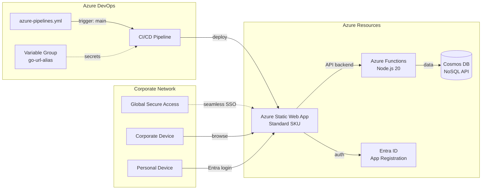
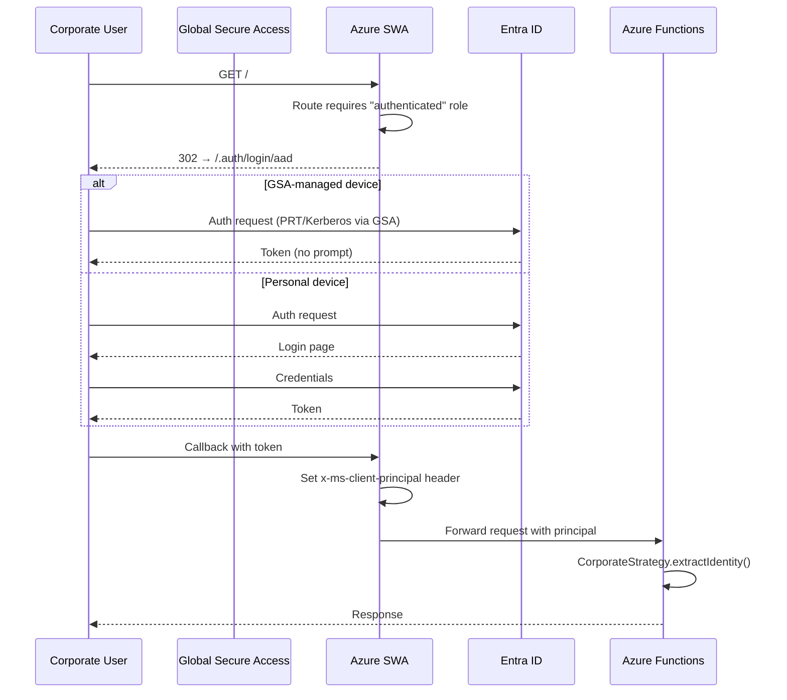

# Design Document: Corporate Azure Deployment

## Overview

This design covers the end-to-end deployment of the Go URL Alias Service as a private corporate application on Azure. The deliverables are:

1. An Azure DevOps CI/CD pipeline (`azure-pipelines.yml`) that builds, tests, and deploys the application to Azure Static Web Apps on every push to `main`.
2. A comprehensive deployment guide (`docs/CORPORATE-DEPLOYMENT.md`) covering Azure resource provisioning, Entra ID SSO, GSA seamless SSO, Entra group-to-role mapping, pipeline setup, environment configuration, and verification/troubleshooting.

The existing codebase already provides the multi-mode auth strategy system, SWA config generator, Cosmos DB data layer, and CORPORATE_LOCK safety mechanism. This design focuses on the pipeline definition and documentation — no new application logic is required.

### Design Rationale

The pipeline is a single-stage YAML definition rather than a multi-stage template because the deployment target is a single SWA resource. The `AzureStaticWebApp@0` task handles the Oryx build internally, but we run our own build and test steps first to fail fast on errors. Secrets are managed via an Azure DevOps variable group (`go-url-alias`) so that the pipeline YAML contains zero hardcoded credentials.

The deployment documentation is a single Markdown file rather than scattered wiki pages so it can be versioned alongside the code and reviewed in pull requests.

## Architecture



### Pipeline Flow

```mermaid
flowchart TD
    A[Push to main] --> B[Install Node.js 20]
    B --> C[npm ci — root]
    C --> D[npm ci — api/]
    D --> E[npm test — root]
    E --> F[npm test — api/]
    F -->|fail| STOP[❌ Halt — no deploy]
    F -->|pass| G[npm run build — root]
    G --> H[npm run build — api/]
    H --> I[AUTH_MODE=corporate<br/>generate SWA config]
    I --> J[AzureStaticWebApp@0<br/>deploy to SWA]
```

### Authentication Flow



## Components and Interfaces

### 1. Azure DevOps Pipeline (`azure-pipelines.yml`)

A YAML pipeline at the repository root with the following structure:

| Section | Purpose |
|---------|---------|
| `trigger` | Fires on pushes to `main` branch only |
| `pool` | Uses `ubuntu-latest` hosted agent |
| `variables` | References the `go-url-alias` variable group |
| `steps` | Sequential: install Node.js 20 → install deps → test → build → generate SWA config → deploy |

The deploy step uses the `AzureStaticWebApp@0` task with:
- `app_location: /` — project root containing `package.json` and `dist/`
- `api_location: api/` — Azure Functions project
- `output_location: dist/` — Vite build output
- `azure_static_web_apps_api_token: $(DEPLOYMENT_TOKEN)` — from variable group
- `skip_app_build: true` — we already built in a prior step
- `skip_api_build: true` — we already built in a prior step

### 2. SWA Configuration Generation (existing)

The pipeline runs `AUTH_MODE=corporate npx tsx scripts/generate-swa-config.ts` to produce `staticwebapp.config.json` with:
- Entra AAD as the sole identity provider
- GitHub, Twitter, Google providers blocked (404)
- All routes requiring `authenticated` role
- 401 override redirecting to `/.auth/login/aad`

This script already exists and is tested. No modifications needed.

### 3. Entra App Registration

Configuration documented in the deployment guide:

| Setting | Value |
|---------|-------|
| Supported account types | Single tenant (this org only) |
| Redirect URI | `https://<swa-hostname>/.auth/login/aad/callback` |
| API permissions | `openid`, `profile`, `email` (Microsoft Graph, delegated) |
| Token configuration | `groupMembershipClaims: SecurityGroup` |
| Client secret | Stored as `AAD_CLIENT_SECRET` in SWA app settings |

### 4. Role Assignment Function

SWA Standard SKU supports a `rolesSource` configuration pointing to an API endpoint that returns custom roles. The deployment guide documents implementing a lightweight Azure Function (or using the existing API) that:
1. Receives the `x-ms-client-principal` header from SWA
2. Decodes the principal to extract Entra group claims
3. Maps the configured admin group object ID to the `"Admin"` role
4. Returns `{ "roles": ["Admin"] }` or `{ "roles": [] }`

### 5. Deployment Documentation (`docs/CORPORATE-DEPLOYMENT.md`)

A single comprehensive Markdown file with these sections:

1. Prerequisites (tools, permissions, Azure subscriptions)
2. Azure Resource Provisioning (SWA, Cosmos DB, Entra App Registration)
3. Entra ID SSO Configuration
4. GSA Seamless SSO Setup
5. Entra Group-to-Role Mapping (Admin role)
6. Azure DevOps Pipeline Setup (variable group, service connection, pipeline creation)
7. Environment Variables and Application Settings
8. SWA Configuration Generation
9. Verification Checklist
10. Troubleshooting

Each provisioning section includes both Azure Portal steps and equivalent Azure CLI commands.

## Data Models

No new data models are introduced. The existing `AliasRecord`, `AuthIdentity`, `ClientPrincipal`, and `AuthStrategy` interfaces remain unchanged.

### Configuration Artifacts

**Pipeline Variable Group (`go-url-alias`)**:

| Variable | Type | Description |
|----------|------|-------------|
| `DEPLOYMENT_TOKEN` | Secret | SWA deployment token from Azure portal |

**SWA Application Settings**:

| Setting | Value | Purpose |
|---------|-------|---------|
| `AUTH_MODE` | `corporate` | Activates CorporateStrategy |
| `CORPORATE_LOCK` | `true` | Prevents mode switching |
| `COSMOS_CONNECTION_STRING` | `AccountEndpoint=...` | Cosmos DB connection |
| `AAD_CLIENT_ID` | `<guid>` | Entra app client ID |
| `AAD_CLIENT_SECRET` | `<secret>` | Entra app client secret |
| `RESTRICT_CREATE_TO_ADMINS` | `true` (optional) | Limits link creation to Admin role |

## Error Handling

### Pipeline Failures

| Failure Point | Behavior | Resolution |
|---------------|----------|------------|
| `npm ci` fails | Pipeline halts, no deploy | Fix dependency issues, re-push |
| `npm test` fails (root or api) | Pipeline halts, no deploy | Fix failing tests, re-push |
| `npm run build` fails | Pipeline halts, no deploy | Fix build errors, re-push |
| SWA config generation fails | Pipeline halts, no deploy | Ensure `AUTH_MODE=corporate` is set in the step |
| `AzureStaticWebApp@0` fails | Deploy fails, previous version remains live | Check deployment token, SWA resource status |
| Invalid deployment token | Deploy task returns auth error | Regenerate token in Azure portal, update variable group |

### Runtime Failures (existing, documented)

| Scenario | Behavior |
|----------|----------|
| `CORPORATE_LOCK=true` + `AUTH_MODE≠corporate` | API refuses to start with descriptive error |
| Missing `COSMOS_CONNECTION_STRING` | API refuses to start |
| Missing `AAD_CLIENT_ID` / `AAD_CLIENT_SECRET` | SWA auth fails, users see Entra error page |
| Entra App Registration misconfigured | Auth callback fails, redirect loop |
| GSA not configured for SWA hostname | Users on corporate devices see Entra login prompt instead of seamless SSO |

## Testing Strategy

### PBT Applicability Assessment

Property-based testing is **not applicable** to this feature. The deliverables are:

1. **A CI/CD pipeline YAML file** — declarative configuration, not executable logic with variable inputs
2. **A deployment documentation Markdown file** — prose documentation, not code
3. **Azure resource configuration** — infrastructure setup, not functions with input/output behavior

The existing codebase already has comprehensive property-based tests for the components this deployment relies on:
- `swa-config.property.ts` — validates SWA config generation for all auth modes, provider enablement, route ordering
- `auth-strategy.property.ts` — validates strategy factory, identity extraction, corporate lock enforcement
- `protected-endpoints.property.ts` — validates auth enforcement on protected endpoints

No new application logic is being written, so no new property tests are needed.

### Recommended Testing Approach

**Pipeline validation:**
- Manual: trigger a pipeline run on a feature branch to verify all steps pass before merging
- The pipeline itself runs the full test suite (`npm test` in root and `api/`) as a gate

**SWA config validation:**
- Existing property tests in `swa-config.property.ts` already cover corporate mode config generation
- Existing snapshot test in `api/tests/unit/swa-config.test.ts` validates the exact output

**Post-deployment verification checklist** (documented in `docs/CORPORATE-DEPLOYMENT.md`):
1. Navigate to SWA URL — should redirect to Entra login (or auto-authenticate via GSA)
2. Verify non-Entra provider routes return 404 (`/.auth/login/github`, etc.)
3. Verify `GET /api/auth-config` returns `{ "mode": "corporate" }`
4. Verify link creation and redirect work for authenticated users
5. Verify Admin role is present for users in the designated Entra group
6. Verify non-admin users cannot access admin-only features (when `RESTRICT_CREATE_TO_ADMINS=true`)
7. Test from a GSA-managed device to confirm seamless SSO (no credential prompt)
8. Test from a personal device to confirm Entra login prompt appears

**Integration testing:**
- Smoke test the deployed SWA endpoint after pipeline completes
- Verify Cosmos DB connectivity by creating and retrieving an alias
- Verify Entra token flow end-to-end
