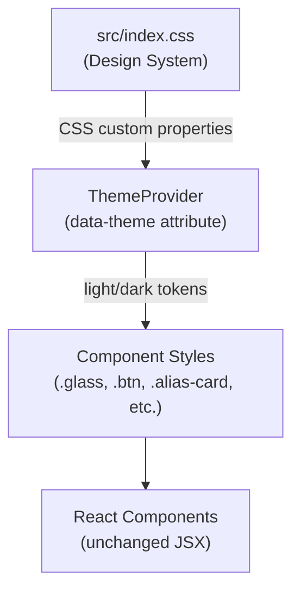

# Design Document: Fluent Glassmorphism Redesign

## Overview

This design covers the visual redesign of the Go URL Alias Service frontend from its current minimal glassmorphism style to a vibrant Fluent Design / Glassmorphism aesthetic with Neo-Brutalism accents. The redesign is primarily CSS-driven. All visual changes target the design system (CSS custom properties and component styles in `src/index.css`) and are applied through the existing `data-theme` attribute managed by `ThemeProvider`. The one JSX change is replacing the plain checkbox private/global toggle in `CreateEditModal` with a segmented pill-style `ScopeToggle` component.

The key visual shifts are:

- A multi-stop vibrant gradient background (blue → purple → pink → cyan) replacing the current two-stop gradient
- Richer frosted-glass surfaces with increased blur and layered transparency
- An azure/sky-blue primary color and electric magenta/pink accent color
- Bold 800-weight headings with tight letter-spacing (Neo-Brutalism accents)
- Tactile button interactions with scale transforms on hover/press
- A secondary `glass--subtle` variant for nested surfaces
- Consistent hover elevation on all interactive glass cards

All existing functionality, accessibility attributes, responsive breakpoints, and keyboard shortcuts remain untouched.

## Architecture

The redesign follows the existing architecture exactly:



All changes are confined to `src/index.css`. The file is structured as:

1. `:root` — shared tokens (typography, spacing, radius, transitions)
2. `[data-theme="light"]` — light theme color tokens
3. `[data-theme="dark"]` — dark theme color tokens
4. Utility classes (`.glass`, `.glass--subtle`, `.container`, `.sr-only`)
5. Component styles (`.app-header`, `.btn`, `.alias-card`, `.modal`, `.search-bar`, `.filter-tabs`, `.popular-links`, `.toast`, `.skeleton`, `.theme-toggle`, `.expiry-selector`, `.form-field`)
6. Media queries (`prefers-reduced-motion`, responsive breakpoints)

No new files are created except `src/components/ScopeToggle.tsx` — a small presentational component for the private/global segmented toggle. The `CreateEditModal` JSX is updated to replace the checkbox with this new toggle. All other React components remain unchanged — components already using the `.glass` class will automatically pick up the updated glass treatment.

## Components and Interfaces

Since this is primarily a CSS redesign, "components" here refers to the CSS class interfaces that each React component consumes. New CSS classes introduced: `glass--subtle` and `.scope-toggle` (with child classes). One new React component is introduced: `ScopeToggle`.

### Design Token Changes (`:root`)

| Token             | Current                              | New                               | Rationale                         |
| ----------------- | ------------------------------------ | --------------------------------- | --------------------------------- |
| `--color-primary` | _(not defined, uses `--focus-ring`)_ | `#0ea5e9` (sky-500)               | Azure/sky-blue primary per mockup |
| `--color-accent`  | _(not defined)_                      | `#e946a0` (electric magenta-pink) | Pink accent per mockup            |
| `--radius`        | `12px`                               | `16px`                            | Slightly rounder for Fluent feel  |
| `--glass-blur`    | `blur(12px)`                         | `blur(16px)`                      | Increased frosted effect          |

### Light Theme Token Changes (`[data-theme="light"]`)

| Token                 | Current                                             | New                                                                           |
| --------------------- | --------------------------------------------------- | ----------------------------------------------------------------------------- |
| `--color-bg-gradient` | `linear-gradient(135deg, #667eea 0%, #764ba2 100%)` | `linear-gradient(135deg, #3b82f6 0%, #8b5cf6 30%, #ec4899 65%, #06b6d4 100%)` |
| `--color-text`        | `#213547`                                           | `#1e293b` (slate-800)                                                         |
| `--glass-bg`          | `rgba(255,255,255,0.65)`                            | `rgba(255,255,255,0.55)`                                                      |
| `--glass-border`      | `rgba(255,255,255,0.3)`                             | `rgba(255,255,255,0.35)`                                                      |
| `--glass-shadow`      | `0 8px 32px rgba(31,38,135,0.12)`                   | `0 8px 32px rgba(31,38,135,0.15)`                                             |
| `--focus-ring`        | `#667eea`                                           | `var(--color-primary)`                                                        |

### Dark Theme Token Changes (`[data-theme="dark"]`)

| Token                 | Current                                             | New                                                                           |
| --------------------- | --------------------------------------------------- | ----------------------------------------------------------------------------- |
| `--color-bg-gradient` | `linear-gradient(135deg, #1e1b4b 0%, #312e81 100%)` | `linear-gradient(135deg, #1e3a5f 0%, #312e81 30%, #701a75 65%, #164e63 100%)` |
| `--glass-bg`          | `rgba(30,41,59,0.7)`                                | `rgba(30,41,59,0.6)`                                                          |
| `--glass-shadow`      | `0 8px 32px rgba(0,0,0,0.3)`                        | `0 8px 32px rgba(0,0,0,0.35)`                                                 |
| `--focus-ring`        | `#818cf8`                                           | `var(--color-primary)`                                                        |

### New CSS Class: `glass--subtle`

A secondary glass variant for nested or less prominent surfaces:

```css
.glass--subtle {
  background: rgba(255, 255, 255, 0.3); /* light */
  backdrop-filter: blur(8px);
  border: 1px solid rgba(255, 255, 255, 0.15);
  box-shadow: 0 4px 16px rgba(31, 38, 135, 0.06);
}
```

Dark theme override reduces opacity further. This class is available for future use but no existing JSX needs to add it — it's a design system extension.

### Component Style Changes

**App Header (`.app-header__title`)**

- Font size: `1.25rem` → `1.75rem`
- Font weight: `600` → `800`
- Letter-spacing: add `-0.02em`
- The word "Go" in the title gets its bold treatment from the weight alone (no JSX change needed since the title is already just "Go")

**Buttons (`.btn--primary`)**

- Background: gradient from `var(--color-primary)` to `var(--color-accent)`
- Border: `2px solid var(--color-primary)` (Neo-Brutalism accent)
- Hover: `transform: scale(1.03)`, increased shadow
- Active: `transform: scale(0.98)`
- `prefers-reduced-motion`: no transforms

**Alias Card (`.alias-card`)**

- Hover: increased shadow depth + slight brightness increase
- Personal badge: uses `--color-accent` tones
- Expiring-soon left border: remains amber

**Modal (`.modal-overlay`, `.modal`)**

- Entry animation: `fadeSlideUp` keyframe (opacity 0→1, translateY 8px→0)
- `prefers-reduced-motion`: no animation
- The checkbox `form-field--inline` for private/global is replaced by the `ScopeToggle` component

**Scope Toggle (`.scope-toggle`) — New Component**

A segmented pill-style toggle replacing the plain checkbox for private/global scope selection. Located in `src/components/ScopeToggle.tsx`.

JSX structure:

```tsx
// ScopeToggle.tsx
interface ScopeToggleProps {
  isPrivate: boolean;
  onChange: (isPrivate: boolean) => void;
}

export function ScopeToggle({ isPrivate, onChange }: ScopeToggleProps) {
  return (
    <div
      className="scope-toggle glass--subtle"
      role="radiogroup"
      aria-label="Link scope"
    >
      <button
        type="button"
        role="radio"
        aria-checked={isPrivate}
        className={`scope-toggle__option ${isPrivate ? "scope-toggle__option--active" : ""}`}
        onClick={() => onChange(true)}
      >
        🔒 Private (Just You)
      </button>
      <button
        type="button"
        role="radio"
        aria-checked={!isPrivate}
        className={`scope-toggle__option ${!isPrivate ? "scope-toggle__option--active" : ""}`}
        onClick={() => onChange(false)}
      >
        🌐 Global (Company)
      </button>
      <div
        className="scope-toggle__slider"
        style={{ transform: isPrivate ? "translateX(0)" : "translateX(100%)" }}
      />
    </div>
  );
}
```

CSS design (added to `src/index.css`):

```css
.scope-toggle {
  display: flex;
  position: relative;
  border-radius: var(--radius);
  padding: 4px;
  gap: 0;
  overflow: hidden;
}

.scope-toggle__option {
  flex: 1;
  padding: 0.5rem 1rem;
  border: none;
  background: transparent;
  cursor: pointer;
  font-weight: 600;
  font-size: 0.875rem;
  color: var(--color-text-secondary);
  z-index: 1;
  transition: color var(--transition-speed) ease;
  text-align: center;
  white-space: nowrap;
}

.scope-toggle__option--active {
  color: white;
}

.scope-toggle__slider {
  position: absolute;
  top: 4px;
  left: 4px;
  width: calc(50% - 4px);
  height: calc(100% - 8px);
  background: var(--color-primary);
  border-radius: calc(var(--radius) - 4px);
  transition: transform 0.25s cubic-bezier(0.4, 0, 0.2, 1);
  box-shadow: 0 2px 8px rgba(0, 0, 0, 0.15);
}
```

The slider element sits behind the buttons (via `position: absolute`) and slides left/right based on the `isPrivate` state. The `cubic-bezier` easing gives it a satisfying, slightly springy feel.

`prefers-reduced-motion`: the slider transition is disabled (instant switch).

CreateEditModal change: Replace the `<label className="form-field form-field--inline">` checkbox block with `<ScopeToggle isPrivate={isPrivate} onChange={setIsPrivate} />`.

**Filter Tabs (`.filter-tabs__tab--active`)**

- Active tab gets `--color-primary` bottom border or background tint

**Theme Toggle (`.theme-toggle__btn--active`)**

- Active segment uses `--color-primary` background with white text

**Toast Notifications**

- Already have glass treatment; toast type tints remain
- `prefers-reduced-motion`: no slide animation

**Skeleton Loaders**

- Base color uses glass-tinted value
- `prefers-reduced-motion`: static (no pulse)

**Popular Links**

- Heading: bold 700 weight, tight letter-spacing
- Heat bars: use `--color-accent` for active bars
- Item hover: subtle elevation

## Data Models

No data model changes. This redesign is purely presentational. All `AliasRecord` types, API interfaces, and state management remain unchanged.

The only "data" relevant to this design is the set of CSS custom properties (design tokens), which are documented in the Components and Interfaces section above.

## Correctness Properties

_A property is a characteristic or behavior that should hold true across all valid executions of a system — essentially, a formal statement about what the system should do. Properties serve as the bridge between human-readable specifications and machine-verifiable correctness guarantees._

### Property 1: WCAG AA contrast for all text/background pairs

_For any_ text color token and its corresponding background surface token, in both light and dark themes, the computed contrast ratio shall be at least 4.5:1 for normal-sized text and at least 3:1 for large text (>= 18.66px bold or >= 24px regular).

This consolidates the contrast requirements across the entire design system: body text on backgrounds (1.3), danger button text on glass surfaces (4.4), status badge text on glass surfaces (5.2), toast text on toast backgrounds (8.3), and the general WCAG AA requirement (11.4). All are instances of the same universal rule: every text/background pair must meet AA contrast.

**Validates: Requirements 1.3, 4.4, 5.2, 8.3, 11.4**

### Property 2: Glass surface treatment invariants

_For any_ element with the `.glass` class, the computed styles shall include: a backdrop-filter with blur radius of at least 12px, a semi-transparent background (alpha < 1.0), a border, and a box-shadow.

This ensures the core glassmorphism treatment is consistently applied to all glass surfaces across the application.

**Validates: Requirements 2.1**

### Property 3: Reduced motion suppresses all decorative animations

_For any_ element in the document, when `prefers-reduced-motion: reduce` is active, all animation-duration, transition-duration, and transform properties used for decorative purposes (hover scales, slide-ins, pulse animations) shall be effectively disabled (duration near zero or transform: none).

This consolidates the reduced-motion requirements for glass surfaces (2.5), button hover/press transforms (4.6), modal animations (6.5), toast animations (8.4), skeleton pulse (12.2), and the general accessibility requirement (11.5).

**Validates: Requirements 2.5, 4.6, 6.5, 8.4, 11.5, 12.2**

### Property 4: Primary heading typography

_For any_ primary heading element (`.app-header__title`, `.modal__heading`, `.popular-links__heading`), the computed font-weight shall be at least 700, and for any heading with computed font-size >= 1.25rem, the letter-spacing shall be at most -0.01em.

This ensures the Neo-Brutalism typography accent is consistently applied across all primary headings.

**Validates: Requirements 3.1, 3.3**

### Property 5: Visible focus indicator on all interactive elements

_For any_ focusable interactive element, when it receives keyboard focus (`:focus-visible`), the element shall display an outline of at least 2px width using `--color-primary` or `--color-accent`, with a visible outline-offset.

This ensures keyboard navigation is always visually apparent across all interactive elements.

**Validates: Requirements 4.5, 11.3**

## Error Handling

This redesign is purely CSS-based and does not introduce new error states or failure modes. The existing error handling remains unchanged:

- **Theme switching failures**: `ThemeProvider` already catches `localStorage` errors gracefully with try/catch blocks. The new color tokens are applied via the same `data-theme` attribute mechanism.
- **Backdrop-filter unsupported**: On browsers that don't support `backdrop-filter`, the glass surfaces degrade gracefully to their semi-transparent background color without blur. No fallback CSS is needed because the existing `background` property provides a usable surface.
- **CSS custom property unsupported**: All modern browsers support CSS custom properties. The design system does not need fallbacks for IE11 (not a target).
- **Gradient background unsupported**: The `background-color: var(--color-bg)` serves as a solid fallback before the gradient is applied via `background-image`.

## Testing Strategy

### Testing Approach

This redesign uses a dual testing approach:

1. **Unit tests (examples)**: Verify specific CSS token values, specific component styles, and specific visual states using computed style checks.
2. **Property-based tests (universal properties)**: Verify that universal rules hold across all relevant elements — contrast ratios, glass treatment consistency, reduced-motion compliance, heading typography, and focus indicators.

Since the frontend project does not currently have a test runner configured (no vitest/jest in `package.json`), the testing strategy recommends adding `vitest` with `jsdom` environment and `@testing-library/react` for DOM-based style assertions. For property-based testing, use `fast-check` which integrates well with vitest.

### Property-Based Testing Configuration

- **Library**: `fast-check` (TypeScript-native, integrates with vitest)
- **Minimum iterations**: 100 per property test
- **Tag format**: Each test tagged with a comment: `// Feature: fluent-glassmorphism-redesign, Property {N}: {title}`

### Test Plan

**Property-based tests** (one test per correctness property):

1. **WCAG AA contrast** — Generate all text/background token pairs from both themes, compute relative luminance and contrast ratio, assert >= 4.5:1 (or 3:1 for large text). Uses fast-check to generate the cross-product of (theme × token-pair).
   `// Feature: fluent-glassmorphism-redesign, Property 1: WCAG AA contrast for all text/background pairs`

2. **Glass surface treatment** — Render each component that uses `.glass`, read computed styles, assert backdrop-filter blur >= 12px, background alpha < 1, border exists, box-shadow exists.
   `// Feature: fluent-glassmorphism-redesign, Property 2: Glass surface treatment invariants`

3. **Reduced motion** — With `prefers-reduced-motion: reduce` media query active, render all animated/transitioned elements, assert animation-duration and transition-duration are near-zero.
   `// Feature: fluent-glassmorphism-redesign, Property 3: Reduced motion suppresses all decorative animations`

4. **Heading typography** — Render all primary heading elements, assert font-weight >= 700 and (if font-size >= 1.25rem) letter-spacing <= -0.01em.
   `// Feature: fluent-glassmorphism-redesign, Property 4: Primary heading typography`

5. **Focus indicator** — For all focusable elements, simulate focus-visible, assert outline width >= 2px and outline uses primary/accent color.
   `// Feature: fluent-glassmorphism-redesign, Property 5: Visible focus indicator on all interactive elements`

**Unit tests** (specific examples and edge cases):

- Verify `--color-primary` is defined and is an azure/sky-blue hue (Req 1.1)
- Verify `--color-accent` is defined and is a magenta/pink hue (Req 1.2)
- Verify body gradient has 4 color stops in light theme (Req 2.2)
- Verify `.glass--subtle` has lower blur than `.glass` (Req 2.3)
- Verify `.app-header__title` has font-size >= 1.5rem and font-weight >= 800 (Req 3.4)
- Verify `.btn--primary` has 2px border (Req 3.5)
- Verify `.btn--primary` has gradient background with primary and accent colors (Req 4.1)
- Verify `.alias-card--expired` has reduced opacity and strikethrough (Req 5.3)
- Verify `.alias-card--expiring` has amber left border (Req 5.4)
- Verify `.modal` has fadeSlideUp animation (Req 6.4)
- Verify `.scope-toggle` renders as a segmented pill with two options and a sliding highlight (Req 6.3, 6.4)
- Verify `.scope-toggle__option--active` has white text and the slider uses `--color-primary` (Req 6.4)
- Verify `ScopeToggle` is keyboard-accessible with `role="radiogroup"` and `aria-checked` attributes (Req 6.6)
- Verify `.filter-tabs__tab--active` uses primary color (Req 7.2)
- Verify `.theme-toggle__btn--active` uses primary color background (Req 10.2)
- Verify responsive breakpoints at 768px and 480px exist (Req 11.1)
- Verify `.skeleton` has glass-tinted base and pulse animation (Req 12.1)
