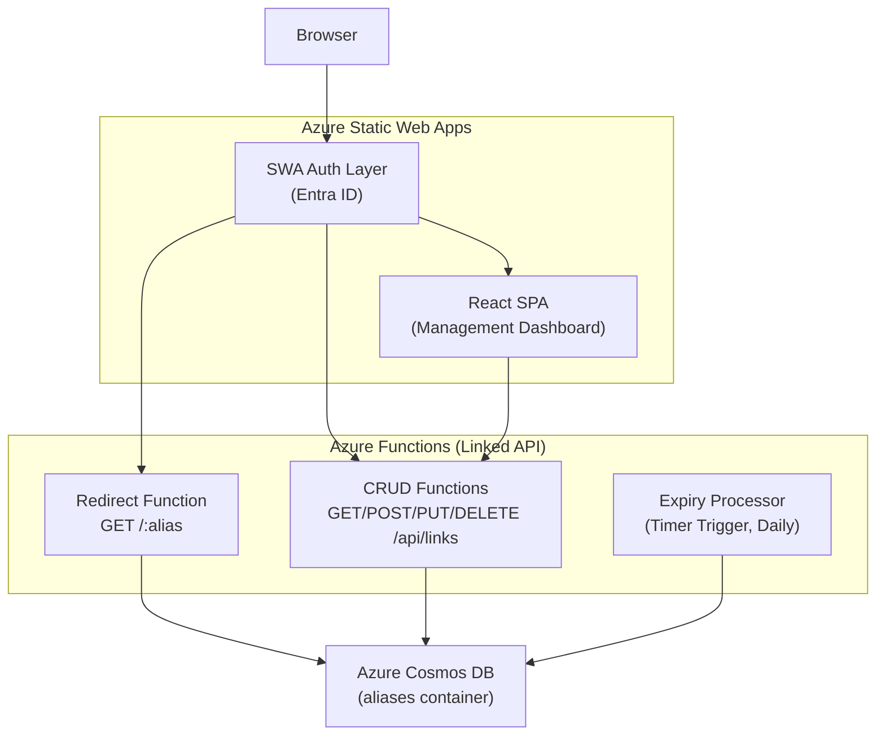
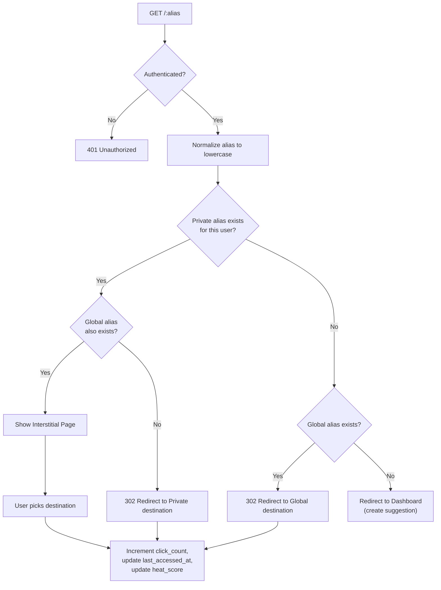
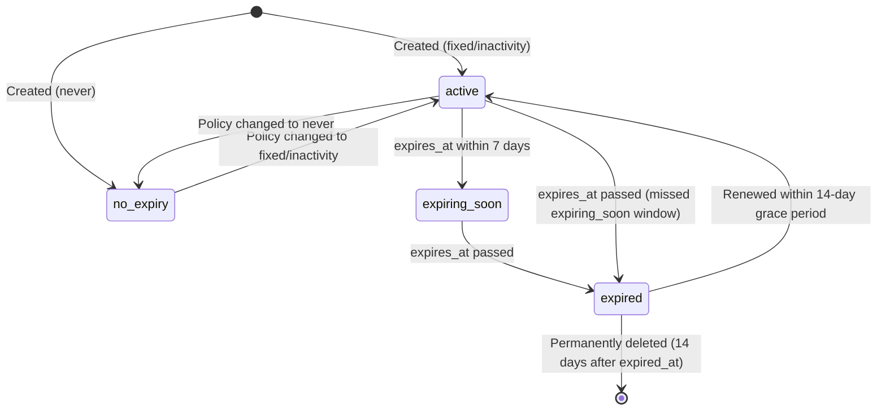

# Design Document: Go URL Alias Service

## Overview

The Go URL Alias Service is an internal URL aliasing platform that lets employees create short, memorable aliases (e.g., `go/benefits`) that redirect to longer destination URLs. The system is built on Azure Static Web Apps (SWA) with an Azure Functions Node.js backend and Azure Cosmos DB for persistence.

The architecture follows a three-tier model:

1. **Frontend** — A React SPA (Management Dashboard) hosted on Azure SWA, using a glassmorphism design language.
2. **Backend API** — Azure Functions (Node.js) providing CRUD endpoints for alias management and a redirection engine.
3. **Database** — Azure Cosmos DB (NoSQL) storing alias records with the `alias` field as the partition key.

Authentication is handled entirely by Azure Entra ID via SWA's built-in auth integration. All routes require authentication. Two roles exist: `User` (manage own aliases) and `Admin` (manage all global aliases). Aliases support global (shared) and private (per-user) scoping, with a private-first resolution strategy during redirection. An expiry lifecycle system with a daily timer-triggered Azure Function manages alias cleanup.



## Architecture

### Request Flow

All incoming requests pass through SWA's authentication layer. The `staticwebapp.config.json` enforces Entra ID authentication on every route and disables all other identity providers.

**Redirection flow (`GET /:alias`):**



**Expired alias handling:** Before performing any redirect, the engine checks `expiry_status`. If `expired`, it returns HTTP 410 Gone and redirects to the dashboard with an expiry message.

**Query string and fragment passthrough:** During redirect, query parameters from the incoming request are merged with the destination URL's parameters (destination takes precedence on duplicates). Fragments from the incoming request are appended unless the destination already has one.

### API Endpoints

| Method | Path                      | Description                                                                                  |
| ------ | ------------------------- | -------------------------------------------------------------------------------------------- |
| GET    | `/:alias`                 | Redirection engine — resolve and redirect                                                    |
| GET    | `/api/links`              | List aliases (global + user's private); supports `sort=clicks`, `sort=heat`, `scope=popular` |
| POST   | `/api/links`              | Create a new alias                                                                           |
| PUT    | `/api/links/:alias`       | Update an alias                                                                              |
| DELETE | `/api/links/:alias`       | Delete an alias                                                                              |
| PUT    | `/api/links/:alias/renew` | Renew an expired/expiring alias                                                              |

### Authentication & Authorization

- SWA config enforces Entra ID on all routes (production)
- In DEV_MODE, authentication is bypassed and mock headers are used instead
- `x-ms-client-principal` header provides user identity (production)
- `x-mock-user-email` and `x-mock-user-roles` headers provide user identity (dev mode)
- Two roles: `User`, `Admin` (mapped to Entra ID groups in production, simulated via headers in dev mode)
- Users can manage their own aliases (global or private)
- Admins can manage any global alias but not other users' private aliases
- GitHub, Twitter, and all non-Entra ID providers are disabled (production)

## Components and Interfaces

### 1. SWA Configuration (`staticwebapp.config.json`)

Defines route rules, authentication providers, role mappings, and navigation fallback. Key responsibilities:

- Enforce Entra ID as sole auth provider
- Disable GitHub/Twitter providers
- Require `authenticated` role on `/api/*` routes
- Configure navigation fallback to `index.html` for SPA routing
- Define custom login route redirecting to Entra ID
- Configure post-login redirect to original URL

### 2. Redirection Engine (Azure Function: `redirect`)

**Trigger:** HTTP GET `/:alias`

**Interface:**

```typescript
// Input: HTTP request with alias path parameter
// Output: HTTP 302 redirect | Interstitial HTML | 401 | 410 | 500

interface RedirectRequest {
  alias: string; // from path param, normalized to lowercase
  userEmail: string; // from x-ms-client-principal
  queryParams: URLSearchParams;
  fragment: string | null;
}

interface RedirectResult {
  status: 302 | 401 | 410 | 500;
  location?: string; // redirect URL with merged query/fragment
  body?: string; // interstitial HTML or error message
}
```

async function handleRedirect(req: RedirectRequest): Promise<RedirectResult>;

````

**Responsibilities:**
- Parse and normalize alias from path
- Extract user identity from `x-ms-client-principal`
- Query Cosmos DB for private alias (user-scoped) then global alias
- Check `expiry_status` — return 410 if expired
- Determine resolution: private-only, global-only, both (interstitial), or none (dashboard redirect)
- Merge query strings and fragments during redirect
- Atomically increment `click_count` and update `last_accessed_at`
- Compute decayed heat score and increment: `new_heat = old_heat * 2^(-hours_elapsed/168) + 1.0`; update `heat_score` and `heat_updated_at`
- For `inactivity` expiry policies, recalculate `expires_at` on access

### 3. Alias CRUD API (Azure Functions)

**Trigger:** HTTP on `/api/links` and `/api/links/:alias`

```typescript
// Alias record as returned by the API
interface AliasRecord {
  id: string;
  alias: string;
  destination_url: string;
  created_by: string;
  title: string;
  click_count: number;
  heat_score: number;
  heat_updated_at: string | null;
  is_private: boolean;
  created_at: string;          // ISO 8601 UTC
  last_accessed_at: string | null;
  expiry_policy_type: 'never' | 'fixed' | 'inactivity';
  duration_months: 1 | 3 | 12 | null;
  custom_expires_at: string | null;
  expires_at: string | null;
  expiry_status: 'active' | 'expiring_soon' | 'expired' | 'no_expiry';
  expired_at: string | null;
}

// POST /api/links body
interface CreateAliasRequest {
  alias: string;               // lowercase alphanumeric + hyphens only
  destination_url: string;     // valid URL
  title: string;
  is_private?: boolean;        // default false
  expiry_policy_type?: 'never' | 'fixed' | 'inactivity';
  duration_months?: 1 | 3 | 12;
  custom_expires_at?: string;  // ISO 8601 UTC, future date
}

// PUT /api/links/:alias body
interface UpdateAliasRequest {
  destination_url?: string;
  title?: string;
  is_private?: boolean;
  expiry_policy_type?: 'never' | 'fixed' | 'inactivity';
  duration_months?: 1 | 3 | 12;
  custom_expires_at?: string;
}
````

**Validation rules:**

- Alias format: `/^[a-z0-9-]+$/` (lowercase alphanumeric and hyphens)
- Destination URL: must be a valid URL format
- Expiry policy type: must be one of `never`, `fixed`, `inactivity`
- Fixed duration: must be 1, 3, or 12 months, or a custom future date
- Inactivity: no configurable duration (hardcoded 12 months)
- Default expiry: `fixed` with `duration_months: 12`

**Authorization logic:**

- GET: returns all global aliases + authenticated user's private aliases
- POST: any authenticated user can create; conflict check for global alias names (case-insensitive)
- PUT/DELETE: creator can modify own aliases; Admins can modify any global alias; no one can modify another user's private alias
- PUT (renew): creator or Admin can renew

### 4. Expiry Processor (Azure Function: `expiryProcessor`)

**Trigger:** Timer (daily, e.g., `0 0 2 * * *` — 2:00 AM UTC)

```typescript
interface ExpiryProcessorResult {
  transitioned_to_expiring_soon: number;
  transitioned_to_expired: number;
  permanently_deleted: number;
  errors: number;
}

async function processExpiry(): Promise<ExpiryProcessorResult>;
```

**Processing logic:**

1. Query all records where `expiry_policy_type !== 'never'`
2. For each record:
   - If `expires_at` is within 7 days and status is `active` → set to `expiring_soon`
   - If `expires_at` is past and status is not `expired` → set to `expired`, set `expired_at` to now
   - If status is `expired` and `expired_at` is older than 14 days → permanently delete
3. Log errors per-record and continue processing
4. Log summary counts on completion

### 5. URL Utility Module

Shared utility for query string and fragment handling during redirects.

```typescript
function mergeUrls(
  destinationUrl: string,
  incomingQuery: URLSearchParams,
  incomingFragment: string | null,
): string;
```

**Merge rules:**

- Query params: merge incoming into destination; destination params take precedence for duplicate keys
- Fragment: use destination fragment if present, otherwise use incoming fragment

### 6. Auth Provider Abstraction and Client Principal Parser

The authentication layer is abstracted behind an `AuthProvider` interface so the same API code works in both production (SWA Entra ID) and local development (mock auth) environments.

```typescript
interface AuthIdentity {
  email: string;
  roles: string[];
}

interface AuthProvider {
  extractIdentity(headers: Record<string, string>): AuthIdentity | null;
}
```

**SwaAuthProvider (production):**

Extracts identity from SWA's `x-ms-client-principal` header. The header value is a Base64-encoded JSON string containing the user's email and roles.

```typescript
interface ClientPrincipal {
  identityProvider: string;
  userId: string;
  userDetails: string; // email
  userRoles: string[];
}

class SwaAuthProvider implements AuthProvider {
  extractIdentity(headers: Record<string, string>): AuthIdentity | null;
}

function parseClientPrincipal(header: string): ClientPrincipal;
```

**MockAuthProvider (dev mode):**

Extracts identity from `x-mock-user-email` and `x-mock-user-roles` headers. Falls back to a default dev user (`dev@localhost` with `User` role) when no mock headers are provided.

```typescript
class MockAuthProvider implements AuthProvider {
  extractIdentity(headers: Record<string, string>): AuthIdentity | null;
}
```

**Provider selection:** At startup, the API checks the `DEV_MODE` environment variable. If `DEV_MODE === 'true'`, the `MockAuthProvider` is used; otherwise, the `SwaAuthProvider` is used. All API functions receive the selected provider via dependency injection or a shared module.

### 7. Management Dashboard (React SPA)

**Key components:**

| Component              | Responsibility                                                    |
| ---------------------- | ----------------------------------------------------------------- |
| `AliasListPage`        | Main page: search bar, filter tabs, alias list                    |
| `AliasCard`            | Individual alias display with click count, expiry status, actions |
| `PopularLinks`         | Homepage section showing top 10 global links ranked by heat score |
| `CreateEditModal`      | Form for creating/editing aliases with expiry policy selector     |
| `ExpiryPolicySelector` | Two-step flow: type selection → duration/date picker              |
| `InterstitialPage`     | Conflict resolution with countdown timer                          |
| `ToastProvider`        | Animated toast notifications                                      |
| `SkeletonLoader`       | Placeholder loading states                                        |
| `SearchBar`            | Debounced search input (300ms) with `/` keyboard shortcut         |

**Design system:**

- Glassmorphism: `backdrop-filter: blur(12px)`, semi-transparent backgrounds, subtle gradients
- Typography: Inter font family with system font fallback
- Animations: smooth CSS transitions, respects `prefers-reduced-motion`
- Accessibility: ARIA labels, keyboard navigation, contrast ratios over blurred backgrounds

### 8. Environment Configuration

All runtime configuration is driven by environment variables, enabling the same codebase to run locally, in a private Azure tenancy, or in production SWA.

| Variable                   | Description                                                         | Required | Default         |
| -------------------------- | ------------------------------------------------------------------- | -------- | --------------- |
| `COSMOS_CONNECTION_STRING` | Connection string for Cosmos DB (emulator or real instance)         | Yes      | —               |
| `DEV_MODE`                 | Set to `true` to enable mock auth and bypass SWA Entra ID           | No       | `false`         |
| `DEV_USER_EMAIL`           | Default mock user email when DEV_MODE is enabled and no headers set | No       | `dev@localhost` |
| `DEV_USER_ROLES`           | Default mock user roles (comma-separated) when DEV_MODE is enabled  | No       | `User`          |

**Files:**

- `.env.example` — Documents all environment variables with placeholder values
- `api/local.settings.json` — Azure Functions local settings template with `COSMOS_CONNECTION_STRING` pointing to the Cosmos DB Emulator and `DEV_MODE` set to `true`

**Local development setup:**

1. Start the Cosmos DB Emulator (or configure a real Cosmos DB connection string)
2. Copy `.env.example` to `.env` and fill in values
3. Run `func start` in the `api/` directory to start the Azure Functions runtime
4. Run `npm run dev` in the frontend directory with Vite proxy configured to forward `/api/*` to `http://localhost:7071`

## Data Models

### Cosmos DB Container: `aliases`

**Partition key:** `/alias`

| Field                | Type            | Description                                                     | Default  |
| -------------------- | --------------- | --------------------------------------------------------------- | -------- |
| `id`                 | string          | Document ID. Global: `{alias}`. Private: `{alias}:{created_by}` | —        |
| `alias`              | string          | Alias name, always lowercase                                    | —        |
| `destination_url`    | string          | Full destination URL                                            | —        |
| `created_by`         | string          | Creator's email (from Client_Principal)                         | —        |
| `title`              | string          | Human-readable title                                            | —        |
| `click_count`        | integer         | Total redirect count                                            | `0`      |
| `heat_score`         | number          | Exponentially decaying popularity score                         | `0`      |
| `heat_updated_at`    | string \| null  | ISO 8601 UTC timestamp of last heat score update                | `null`   |
| `is_private`         | boolean         | Whether this is a private alias                                 | `false`  |
| `created_at`         | string          | ISO 8601 UTC creation timestamp                                 | —        |
| `last_accessed_at`   | string \| null  | ISO 8601 UTC last redirect timestamp                            | `null`   |
| `expiry_policy_type` | string          | `never` \| `fixed` \| `inactivity`                              | `fixed`  |
| `duration_months`    | integer \| null | 1, 3, or 12 (for fixed preset)                                  | `null`   |
| `custom_expires_at`  | string \| null  | ISO 8601 UTC (for fixed custom date)                            | `null`   |
| `expires_at`         | string \| null  | Computed expiry timestamp; null for `never`                     | —        |
| `expiry_status`      | string          | `active` \| `expiring_soon` \| `expired` \| `no_expiry`         | `active` |
| `expired_at`         | string \| null  | Timestamp when alias transitioned to `expired`                  | `null`   |

### ID Strategy

- **Global aliases:** `id = alias` (e.g., `"benefits"`). Since the partition key is also `alias`, each global alias is uniquely identified within its partition.
- **Private aliases:** `id = {alias}:{created_by}` (e.g., `"benefits:user@example.com"`). This allows multiple users to have private aliases with the same name within the same partition.

### Query Patterns

| Query                     | Cosmos DB Operation                                                                 |
| ------------------------- | ----------------------------------------------------------------------------------- |
| Resolve alias (redirect)  | Point read by partition key `alias`, then filter by `is_private` and `created_by`   |
| List all aliases for user | Cross-partition query: `WHERE is_private = false OR created_by = @email`            |
| Search aliases            | Cross-partition query with `CONTAINS()` on `alias` and `title`                      |
| Sort by clicks            | Cross-partition query with `ORDER BY click_count DESC`                              |
| Sort by heat              | Cross-partition query with `ORDER BY heat_score DESC`                               |
| Popular global links      | Cross-partition query: `WHERE is_private = false ORDER BY heat_score DESC` (top 10) |
| Expiry processing         | Cross-partition query: `WHERE expiry_policy_type != 'never'`                        |
| Conflict check (create)   | Point read by partition key `alias` where `is_private = false`                      |

### Expiry Computation

| Policy Type      | `expires_at` Calculation                        |
| ---------------- | ----------------------------------------------- |
| `never`          | `null`                                          |
| `fixed` (preset) | `created_at + duration_months`                  |
| `fixed` (custom) | `custom_expires_at` value                       |
| `inactivity`     | `max(created_at, last_accessed_at) + 12 months` |

### Heat Score Computation

The heat score uses lazy exponential decay — it is only recalculated when the alias is accessed via the Redirection Engine.

**Decay formula:** `new_heat = old_heat * decay_factor^(hours_since_last_update) + increment`

| Parameter      | Value                 | Notes                                    |
| -------------- | --------------------- | ---------------------------------------- |
| `decay_factor` | `2^(-1/168)` ≈ 0.9959 | Derived from 7-day half-life             |
| `half_life`    | 168 hours (7 days)    | Heat score halves after 7 days of no use |
| `increment`    | 1.0                   | Fixed value added per redirect           |
| `initial_heat` | 0                     | Default for new alias records            |

**On redirect:**

1. Read current `heat_score` and `heat_updated_at`
2. If `heat_updated_at` is null, set `new_heat = 1.0`
3. Otherwise, compute `hours_elapsed = (now - heat_updated_at) / 3600000`
4. Compute `new_heat = heat_score * 2^(-hours_elapsed / 168) + 1.0`
5. Write `heat_score = new_heat` and `heat_updated_at = now`

On renewal, `expires_at` is recalculated from the current time using the same policy. On access with `inactivity` policy, `expires_at` is reset to 12 months from now.

### Expiry State Machine



## Correctness Properties

_A property is a characteristic or behavior that should hold true across all valid executions of a system — essentially, a formal statement about what the system should do. Properties serve as the bridge between human-readable specifications and machine-verifiable correctness guarantees._

### Property 1: Alias resolution follows private-first precedence

_For any_ authenticated user and any alias name, the redirection engine should:

- Return the private alias destination if only a private alias exists for that user
- Return the global alias destination if only a global alias exists
- Show the interstitial page if both a private and global alias exist
- Redirect to the dashboard with a create suggestion if neither exists
- Treat another user's private alias as non-existent

**Validates: Requirements 1.4, 1.5, 1.6, 1.7, 7.1, 7.2**

### Property 2: URL merging preserves destination precedence

_For any_ destination URL, any set of incoming query parameters, and any incoming fragment:

- All incoming query parameters should appear in the final URL unless overridden by a destination parameter with the same key
- The destination's query parameters take precedence for duplicate keys
- The destination's fragment takes precedence over the incoming fragment
- Query string and fragment handling are independent of each other

**Validates: Requirements 1.12, 1.13, 1.14**

### Property 3: Successful redirect increments analytics

_For any_ alias that is successfully redirected, the `click_count` of the alias record should increase by exactly 1, the `last_accessed_at` timestamp should be updated to a value no earlier than the time of the request, and the `heat_score` should be updated by applying exponential decay to the previous value and adding 1.0.

**Validates: Requirements 1.8, 1.9, 1.10, 6.1, 6.2, 6.3, 15.2, 15.5**

### Property 4: Expired aliases block redirection

_For any_ alias record with `expiry_status` set to `expired`, the redirection engine should return HTTP 410 Gone and never perform a redirect.

**Validates: Requirements 1.10, 10.3**

### Property 5: Inactivity expiry resets on access

_For any_ alias record with `expiry_policy_type` set to `inactivity`, when the alias is accessed via the redirection engine, the `expires_at` timestamp should be recalculated to 12 months from the current UTC time.

**Validates: Requirements 9.7**

### Property 6: API returns globals plus only the requesting user's private aliases

_For any_ authenticated user and any set of alias records in the database, a GET request to `/api/links` should return all global alias records and only the private alias records where `created_by` matches the authenticated user's email. No other user's private aliases should ever appear in the response.

**Validates: Requirements 2.1, 7.3, 7.4**

### Property 7: Search filters by alias or title

_For any_ search term and any set of alias records visible to the user, all records returned by the search endpoint should have the search term as a case-insensitive substring of either the `alias` or `title` field.

**Validates: Requirements 2.2**

### Property 8: Alias creation applies correct defaults

_For any_ valid alias creation request that omits the `expiry_policy_type`, the created record should have `expiry_policy_type` set to `fixed`, `duration_months` set to 12, `click_count` set to 0, `created_by` set to the authenticated user's email, and `created_at` set to the current UTC time.

**Validates: Requirements 2.3, 9.6**

### Property 9: Global alias names are unique (case-insensitive)

_For any_ alias name, if a global alias already exists with that name (compared case-insensitively), attempting to create another global alias with the same name should return HTTP 409 Conflict.

**Validates: Requirements 2.4, 2.17**

### Property 10: Invalid inputs are rejected with 400

_For any_ alias creation or update request:

- If the destination URL is not a valid URL format, the API should return 400
- If the alias contains characters other than lowercase alphanumeric and hyphens, the API should return 400
- If the expiry policy type is not one of `never`, `fixed`, or `inactivity`, the API should return 400

**Validates: Requirements 2.11, 2.12, 2.13**

### Property 11: Fixed expiry policy accepts valid configurations only

_For any_ alias creation or update request with `expiry_policy_type` set to `fixed`, the API should accept either a `duration_months` value of 1, 3, or 12, or a `custom_expires_at` value that is a future ISO 8601 UTC timestamp, but not both and not neither.

**Validates: Requirements 2.14**

### Property 12: Expiry timestamp is computed correctly from policy

_For any_ alias record:

- If `expiry_policy_type` is `never`, then `expires_at` should be null and `expiry_status` should be `no_expiry`
- If `expiry_policy_type` is `fixed` with `duration_months`, then `expires_at` should equal the creation time plus that many months
- If `expiry_policy_type` is `fixed` with `custom_expires_at`, then `expires_at` should equal the custom date
- If `expiry_policy_type` is `inactivity`, then `expires_at` should be 12 months from the creation time

**Validates: Requirements 9.2, 9.3, 9.4, 9.5, 2.15**

### Property 13: Update recalculates expiry and resets status

_For any_ alias record owned by the authenticated user, when a PUT request updates the expiry policy, the `expires_at` timestamp should be recalculated based on the new policy and the `expiry_status` should be reset to `active`.

**Validates: Requirements 2.5, 2.6**

### Property 14: Delete removes the record

_For any_ alias record owned by the authenticated user, after a successful DELETE request, the record should no longer exist in the database and should not appear in subsequent GET responses.

**Validates: Requirements 2.7**

### Property 15: Sort by clicks produces descending order

_For any_ set of alias records, when the API is called with `sort=clicks`, the returned records should be ordered by `click_count` in descending order (each record's click count should be greater than or equal to the next record's click count). Similarly, when the API is called with `sort=heat`, the returned records should be ordered by `heat_score` in descending order.

**Validates: Requirements 2.8, 2.9, 6.5, 15.9**

### Property 16: Authorization enforces role-based access

_For any_ authenticated user, alias record, and mutation operation (PUT or DELETE):

- A User who did not create a global alias should receive 403
- An Admin should be allowed to modify any global alias regardless of creator
- An Admin should receive 403 when attempting to modify another user's private alias
- Private alias operations should be scoped to the authenticated user's own records

**Validates: Requirements 3.3, 3.4, 3.5, 2.10**

### Property 17: Alias record invariants

_For any_ alias record stored in the database:

- The `alias` field should be lowercase
- The `id` field should equal the alias name for global records, or `{alias}:{created_by}` for private records
- All required fields (`id`, `alias`, `destination_url`, `created_by`, `title`, `click_count`, `heat_score`, `is_private`, `created_at`, `expiry_policy_type`, `expiry_status`) should be present
- `click_count`, `last_accessed_at`, and `heat_score` should be included in API responses
- `heat_score` should be non-negative

**Validates: Requirements 5.2, 5.3, 5.4, 5.5, 2.10, 6.4, 15.1, 15.11**

### Property 18: Expiry state machine transitions are correct

_For any_ set of alias records where `expiry_policy_type` is not `never`, when the expiry processor runs:

- Records with `expires_at` within 7 days and status `active` should transition to `expiring_soon`
- Records with `expires_at` in the past and status not `expired` should transition to `expired` with `expired_at` set
- Records with status `expired` and `expired_at` older than 14 days should be permanently deleted
- Records with `expiry_policy_type` equal to `never` should not be evaluated

**Validates: Requirements 10.1, 10.2, 10.5, 11.2, 11.3, 11.4, 11.5**

### Property 19: Renewal resets alias to active state

_For any_ expired alias record within the 14-day grace period, when renewed by the owner or an Admin, the `expiry_status` should be set to `active`, `expires_at` should be recalculated based on the current expiry policy, and `expired_at` should be cleared to null.

**Validates: Requirements 2.16, 10.4, 10.6**

### Property 20: Client principal identity extraction

_For any_ valid Base64-encoded `x-ms-client-principal` header, the parser should extract the correct email address. The API should use only this extracted identity for `created_by` fields, ownership checks, and private alias scoping, ignoring any user-provided identity in request bodies.

**Validates: Requirements 14.15, 14.17**

### Property 21: Expiry processor summary matches actual transitions

_For any_ run of the expiry processor, the logged summary counts (transitioned to `expiring_soon`, transitioned to `expired`, permanently deleted) should exactly match the number of records that were actually transitioned or deleted during that run.

**Validates: Requirements 11.7**

### Property 22: Heat score decay is monotonically decreasing over idle time

_For any_ alias record with a positive `heat_score` and no intervening redirects, the heat score should decrease over time following the exponential decay formula `heat * 2^(-hours/168)`. After 168 hours (7 days) of inactivity, the heat score should be approximately half of its previous value. The heat score should never become negative. When a redirect occurs, the new heat score should equal the decayed value plus 1.0.

**Validates: Requirements 15.2, 15.3, 15.4, 15.5**

### Property 23: Popular links returns only top global aliases by heat

_For any_ set of alias records in the database, when the API is called with `scope=popular`, the response should contain at most 10 records, all of which should be Global_Alias records (not private), and they should be ordered by `heat_score` in descending order.

**Validates: Requirements 15.6, 15.8, 15.10**

### Property 24: Auth provider uses correct identity source based on mode

_For any_ request to the API:

- When `DEV_MODE` is not enabled, the auth provider should extract identity exclusively from the `x-ms-client-principal` header (Base64-encoded Client_Principal)
- When `DEV_MODE` is enabled and `x-mock-user-email` / `x-mock-user-roles` headers are present, the auth provider should use those headers for identity
- When `DEV_MODE` is enabled and no mock headers are present, the auth provider should default to the preconfigured dev user (`dev@localhost` with `User` role)
- The `DEV_MODE` flag should never be enabled in production deployments

**Validates: Requirements 14.19, 16.1, 16.2, 16.3, 16.4**

## Error Handling

### Redirection Engine Errors

| Scenario                | Response                  | Behavior                                                 |
| ----------------------- | ------------------------- | -------------------------------------------------------- |
| Unauthenticated request | 401 Unauthorized          | SWA auth layer rejects before reaching function          |
| Alias not found         | 302 to Dashboard          | Redirect with `?suggest={alias}` query param             |
| Expired alias           | 410 Gone                  | Redirect to Dashboard with expiry message                |
| Database error          | 500 Internal Server Error | Generic message to client; full error logged server-side |

### API Errors

| Scenario                      | Response         | Details                                       |
| ----------------------------- | ---------------- | --------------------------------------------- |
| Invalid URL format            | 400 Bad Request  | Descriptive validation message                |
| Invalid alias format          | 400 Bad Request  | Allowed format: `[a-z0-9-]+`                  |
| Invalid expiry policy         | 400 Bad Request  | Allowed types: `never`, `fixed`, `inactivity` |
| Duplicate global alias        | 409 Conflict     | Descriptive conflict message                  |
| Not owner (User role)         | 403 Forbidden    | Cannot modify others' global aliases          |
| Admin modifying private alias | 403 Forbidden    | Admin privileges apply to global only         |
| Unauthenticated               | 401 Unauthorized | SWA auth layer rejects                        |

### Expiry Processor Errors

- Per-record errors are logged and processing continues to the next record
- A summary is logged at the end of each run with counts of transitions and errors
- The processor does not halt on individual record failures

### Frontend Error Handling

- API errors are displayed as animated toast notifications with user-readable messages
- Internal error details are never exposed to the user
- Network failures show a generic connectivity error toast
- Session expiry redirects to Entra ID login, preserving the current URL for post-login redirect

## Testing Strategy

### Dual Testing Approach

This project uses both unit tests and property-based tests for comprehensive coverage:

- **Unit tests**: Verify specific examples, edge cases, error conditions, and integration points
- **Property-based tests**: Verify universal properties across randomly generated inputs

### Property-Based Testing Configuration

- **Library**: [fast-check](https://github.com/dubzzz/fast-check) (JavaScript/TypeScript PBT library)
- **Minimum iterations**: 100 per property test
- **Tag format**: Each property test must include a comment referencing the design property:
  ```
  // Feature: go-url-alias-service, Property {number}: {property_text}
  ```
- Each correctness property must be implemented by a single property-based test

### Unit Test Coverage

Unit tests should focus on:

- Specific examples demonstrating correct behavior (e.g., a concrete alias resolution scenario)
- Edge cases: empty alias, alias with only hyphens, maximum-length alias, URL with complex query strings and fragments
- Error conditions: database failures, malformed Client_Principal headers, invalid JSON bodies
- Integration points: Cosmos DB operations, SWA auth header parsing
- Interstitial page rendering with both destinations
- Expiry processor error resilience (one bad record doesn't stop processing)

### Property Test Coverage

Each of the 24 correctness properties above should be implemented as a property-based test using fast-check. Key generators needed:

- **Alias generator**: Random lowercase alphanumeric strings with hyphens
- **URL generator**: Random valid URLs with optional query strings and fragments
- **AliasRecord generator**: Random complete alias records with valid field combinations
- **ExpiryPolicy generator**: Random valid expiry policy configurations
- **HeatScore generator**: Random heat score values (non-negative) with timestamps for decay testing
- **ClientPrincipal generator**: Random Base64-encoded client principal headers
- **User/role generator**: Random user emails with User or Admin roles

### Test Organization

```
tests/
├── unit/
│   ├── redirect.test.ts          # Redirection engine unit tests
│   ├── api.test.ts               # CRUD API unit tests
│   ├── expiry-processor.test.ts  # Expiry processor unit tests
│   ├── url-utils.test.ts         # URL merging unit tests
│   └── client-principal.test.ts  # Client principal parser unit tests
└── property/
    ├── redirect.property.ts      # Properties 1, 3, 4, 5, 22
    ├── api-scoping.property.ts   # Properties 6, 7, 15, 16, 23
    ├── api-crud.property.ts      # Properties 8, 9, 10, 11, 13, 14
    ├── url-merge.property.ts     # Property 2
    ├── expiry.property.ts        # Properties 12, 18, 19, 21
    ├── schema.property.ts        # Property 17
    └── identity.property.ts      # Properties 20, 24
```
