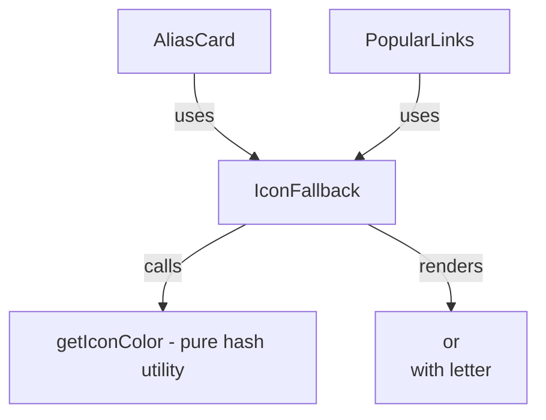

# Design Document: Icon Fallback

## Overview

This feature introduces an `IconFallback` React component that provides a consistent, visually appealing fallback when a link's favicon is unavailable or fails to load. Instead of showing broken images or a generic 🔗 emoji, the component renders a letter-based icon with a deterministic background color derived from the link's title. The component will be integrated into both `AliasCard` and `PopularLinks`, replacing their current ad-hoc icon/placeholder logic.

## Architecture

The solution is a single presentational React component (`IconFallback`) with a pure utility module for color generation. No backend changes are needed.



**Flow:**

1. `IconFallback` receives `iconUrl`, `title`, `alias`, and `size` as props.
2. If `iconUrl` is provided, it renders an `` tag with an `onError` handler.
3. On image load failure (or if `iconUrl` is null/empty), it renders a `<div>` displaying the first character of `title` (or `alias` as fallback) on a deterministically colored background.
4. The background color is computed via a simple hash of the title string, selecting from a curated palette that guarantees WCAG AA contrast with white text.

## Components and Interfaces

### IconFallback Component

```typescript
interface IconFallbackProps {
  iconUrl: string | null;
  title: string;
  alias: string;
  size: number; // px, e.g. 20 for AliasCard, 32 for PopularLinks
}

function IconFallback({
  iconUrl,
  title,
  alias,
  size,
}: IconFallbackProps): JSX.Element;
```

**Behavior:**

- If `iconUrl` is truthy, renders `` with `onError` that switches to the generated icon.
- If `iconUrl` is falsy, renders the generated icon directly.
- The generated icon is a `<div>` with inline styles for the background color, dimensions (`size × size`), border-radius, centered bold letter, and white text color.
- Sets `aria-hidden="true"` on the element since adjacent link text provides context.
- Does not add any focusable elements (no `tabIndex`).

### getIconColor Utility

```typescript
function getIconColor(text: string): string;
```

- Takes a string (title), computes a simple hash (sum of char codes), and maps it to an index in a curated color palette.
- The palette consists of colors that all meet WCAG AA contrast ratio (≥ 4.5:1) against white (`#FFFFFF`).
- Returns a hex color string.

### getIconLetter Utility

```typescript
function getIconLetter(title: string, alias: string): string;
```

- Returns the first character of `title`, uppercased.
- If `title` is empty/undefined, returns the first character of `alias`, uppercased.
- If both are empty, returns `"?"`.

### Integration Changes

**AliasCard.tsx:**

- Remove the inline `` + `<span>` placeholder + `onError` DOM manipulation logic.
- Replace with `<IconFallback iconUrl={record.icon_url} title={record.title} alias={record.alias} size={20} />`.

**PopularLinks.tsx:**

- Remove the conditional `` / `<span>` placeholder rendering.
- Replace with `<IconFallback iconUrl={link.icon_url} title={link.title} alias={link.alias} size={32} />`.

## Data Models

No new data models are introduced. The component consumes existing fields from `AliasRecord`:

| Field      | Type             | Usage                                |
| ---------- | ---------------- | ------------------------------------ |
| `icon_url` | `string \| null` | Primary favicon source               |
| `title`    | `string`         | Letter source + hash input for color |
| `alias`    | `string`         | Fallback letter source               |

### Color Palette

A curated array of hex colors, all with ≥ 4.5:1 contrast ratio against `#FFFFFF`:

```typescript
const ICON_COLORS = [
  "#e11d48", // rose-600
  "#9333ea", // purple-600
  "#2563eb", // blue-600
  "#0891b2", // cyan-600
  "#059669", // emerald-600
  "#ca8a04", // yellow-600
  "#ea580c", // orange-600
  "#dc2626", // red-600
  "#7c3aed", // violet-600
  "#0d9488", // teal-600
];
```

## Correctness Properties

_A property is a characteristic or behavior that should hold true across all valid executions of a system — essentially, a formal statement about what the system should do. Properties serve as the bridge between human-readable specifications and machine-verifiable correctness guarantees._

### Property 1: Icon letter derivation

_For any_ non-empty title string and any alias string, `getIconLetter(title, alias)` should return the first character of `title`, uppercased. _For any_ empty title and non-empty alias, it should return the first character of `alias`, uppercased.

**Validates: Requirements 1.3, 1.4**

### Property 2: Icon color determinism

_For any_ title string, calling `getIconColor(title)` multiple times should always return the same hex color string.

**Validates: Requirements 3.1, 3.2**

### Property 3: WCAG AA contrast for generated icon colors

_For any_ title string, the color returned by `getIconColor(title)` paired with white (`#FFFFFF`) text must have a contrast ratio of at least 4.5:1 per WCAG 2.0.

**Validates: Requirements 3.4**

### Property 4: Size prop determines rendered dimensions

_For any_ positive integer size value, when `IconFallback` renders a generated icon (no `iconUrl`), the rendered element's width and height should both equal the provided `size` value in pixels.

**Validates: Requirements 2.2, 4.3**

### Property 5: Fallback rendering on missing or failed icon URL

_For any_ `IconFallback` instance where `iconUrl` is null or empty, the component should render a generated icon (letter div) instead of an `` element.

**Validates: Requirements 1.1, 2.1**

### Property 6: Accessibility attributes on generated icon

_For any_ rendered generated icon, the element should have `aria-hidden="true"` set and should not be focusable (no `tabIndex` attribute).

**Validates: Requirements 5.1, 5.2**

## Error Handling

| Scenario                           | Handling                                                                           |
| ---------------------------------- | ---------------------------------------------------------------------------------- |
| `iconUrl` image fails to load      | `onError` handler sets internal state to show generated icon; no retry             |
| `title` and `alias` are both empty | `getIconLetter` returns `"?"` as a safe fallback                                   |
| `title` is undefined/null          | Treated as empty string; falls through to alias                                    |
| `size` is 0 or negative            | Component renders with the given size (no special handling; caller responsibility) |
| Hash produces out-of-range index   | Modulo operation on palette length ensures valid index                             |

## Testing Strategy

### Unit Tests

Unit tests verify specific examples and edge cases using `vitest` + `@testing-library/react`:

- `IconFallback` renders an `` when `iconUrl` is provided
- `IconFallback` renders a letter div when `iconUrl` is null
- `IconFallback` switches from `` to letter div on image error event
- `getIconLetter` returns `"?"` when both title and alias are empty
- `getIconColor` returns a valid hex color string
- `AliasCard` renders `IconFallback` (integration check)
- `PopularLinks` renders `IconFallback` (integration check)

### Property-Based Tests

Property-based tests use `fast-check` (already in devDependencies) with minimum 100 iterations per property. Each test references its design document property.

- **Feature: icon-fallback, Property 1: Icon letter derivation** — Generate random title/alias strings, verify `getIconLetter` output matches spec.
- **Feature: icon-fallback, Property 2: Icon color determinism** — Generate random titles, call `getIconColor` twice, assert equality.
- **Feature: icon-fallback, Property 3: WCAG AA contrast** — Generate random titles, compute contrast ratio of `getIconColor(title)` vs `#FFFFFF`, assert ≥ 4.5.
- **Feature: icon-fallback, Property 4: Size prop dimensions** — Generate random positive integers, render `IconFallback` with no `iconUrl`, assert element dimensions match.
- **Feature: icon-fallback, Property 5: Fallback rendering** — Generate random null/empty `iconUrl` values, assert no `` in rendered output.
- **Feature: icon-fallback, Property 6: Accessibility attributes** — Generate random props, render generated icon, assert `aria-hidden="true"` and no `tabIndex`.

Each property-based test must be implemented as a single `fc.assert(fc.property(...))` call with `{ numRuns: 100 }` minimum.
