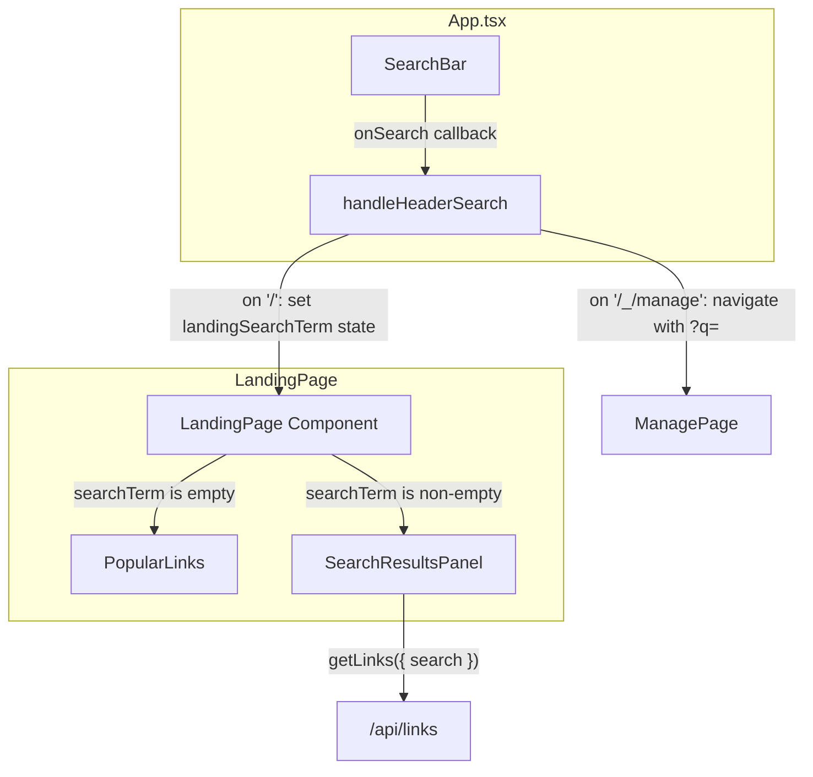

# Design Document: Inline Landing Search

## Overview

This feature replaces the current search-then-navigate behavior on the landing page with inline search results. Today, typing in the header `SearchBar` on the landing page (`/`) navigates the user to `/_/manage` to display results. This is disruptive, especially for unauthenticated users who have no business on the manage page.

The new behavior: when a user types a search term on the landing page, the `PopularLinks` section is replaced by a `SearchResultsPanel` that displays matching `AliasRecord`s in the same card-based list style. Clearing the search restores `PopularLinks`. The `/_/manage` route continues to work as before.

### Key Design Decisions

1. **Lift search state into `App.tsx`**: The header `SearchBar` already lives in `App.tsx`. Rather than prop-drilling or adding a context, we pass the current search term down to `LandingPage` as a prop. `App.tsx` already manages the `handleHeaderSearch` callback — we modify it to set local state instead of navigating when on `/`.
2. **New `SearchResultsPanel` component**: A focused component that takes a search term, calls `getLinks({ search })`, and renders results in the same list format as `PopularLinks`. This keeps `LandingPage` clean and the search results logic isolated.
3. **Reuse existing API and styles**: The `getLinks` function in `api.ts` already supports a `search` parameter. The `PopularLinks` list item layout (icon, alias, title, URL) is reused for search results to maintain visual consistency.
4. **No new routes or contexts**: The feature is entirely contained within the landing page view. No router changes, no new React contexts.

## Architecture



### Flow

1. User types in `SearchBar` → `handleHeaderSearch` fires (debounced 300ms by `SearchBar`).
2. If on `/`: `App` sets `landingSearchTerm` state. `LandingPage` receives it as a prop.
3. If `searchTerm` is non-empty: `LandingPage` hides `PopularLinks`, shows `SearchResultsPanel`.
4. `SearchResultsPanel` calls `getLinks({ search: term })` and renders results.
5. If `searchTerm` is empty: `LandingPage` hides `SearchResultsPanel`, shows `PopularLinks`.
6. If on `/_/manage`: existing navigate-with-query behavior is preserved.

### Escape Key Behavior

The `SearchBar` component needs a small enhancement: when the user presses Escape while focused, it clears the input value and blurs the input. This restores `PopularLinks` on the landing page. The existing `/` shortcut to focus is already implemented.

## Components and Interfaces

### Modified: `App.tsx`

**Changes:**
- Add `landingSearchTerm` state (`useState<string>("")`).
- Modify `handleHeaderSearch`: when on `/`, set `landingSearchTerm` instead of navigating.
- Modify `handleHeaderSubmit`: when on `/`, set `landingSearchTerm` instead of navigating.
- Pass `searchTerm={landingSearchTerm}` to `LandingPage`.
- Reset `landingSearchTerm` to `""` when navigating away from `/` (via `useEffect` on `location.pathname`).

```typescript
// New state in App
const [landingSearchTerm, setLandingSearchTerm] = useState("");

// Modified handleHeaderSearch
const handleHeaderSearch = useCallback((term: string) => {
  if (location.pathname === "/") {
    setLandingSearchTerm(term);
  } else {
    navigate(
      term ? `/_/manage?q=${encodeURIComponent(term)}` : isManagePage ? "/_/manage" : "/",
      { replace: true }
    );
  }
}, [location.pathname, isManagePage, navigate]);

// Reset on route change
useEffect(() => {
  if (location.pathname !== "/") {
    setLandingSearchTerm("");
  }
}, [location.pathname]);
```

### Modified: `LandingPage.tsx`

**Changes:**
- Accept `searchTerm` prop.
- Conditionally render `SearchResultsPanel` (when `searchTerm` is non-empty) or `PopularLinks` (when empty).

```typescript
interface LandingPageProps {
  searchTerm?: string;
}

export function LandingPage({ searchTerm = "" }: LandingPageProps) {
  // ... existing state ...
  return (
    <section className="landing-page">
      {canCreate && (/* Create New button */)}
      {searchTerm ? (
        <SearchResultsPanel searchTerm={searchTerm} />
      ) : (
        <PopularLinks refreshKey={refreshKey} />
      )}
      {/* ... modal ... */}
    </section>
  );
}
```

### Modified: `SearchBar.tsx`

**Changes:**
- Add Escape key handler: clears value and blurs input.
- Expose an optional `onClear` callback for parent components that need to know when the search was cleared via Escape.

```typescript
// Inside the existing keydown handler or a new one on the input:
const handleKeyDown = (e: React.KeyboardEvent) => {
  if (e.key === "Escape") {
    setValue("");
    onSearch("");
    inputRef.current?.blur();
  }
};
```

### New: `SearchResultsPanel.tsx`

**Props:**
```typescript
interface SearchResultsPanelProps {
  searchTerm: string;
}
```

**Behavior:**
- Calls `getLinks({ search: searchTerm })` when `searchTerm` changes.
- Displays loading skeletons while fetching.
- Renders results in the same list format as `PopularLinks` (reuses CSS classes: `popular-links__list`, `popular-links__item`, etc.).
- Shows empty state message when no results found.
- Shows error message on API failure.

**Structure:**
```
<section class="popular-links" aria-label="Search results">
  <h2 class="popular-links__heading">Search Results</h2>
  {loading ? <SkeletonLoader /> : results.length === 0 ? <empty state> : <ol class="popular-links__list">...</ol>}
</section>
```

## Data Models

No new data models are introduced. The feature uses the existing `AliasRecord` interface from `api.ts` and the existing `getLinks({ search })` API call.

### State Shape

| Component | State | Type | Purpose |
|---|---|---|---|
| `App` | `landingSearchTerm` | `string` | Current search term for landing page |
| `SearchResultsPanel` | `results` | `AliasRecord[]` | API response |
| `SearchResultsPanel` | `loading` | `boolean` | Fetch in progress |
| `SearchResultsPanel` | `error` | `string \| null` | API error message |

### API Call

```
GET /api/links?search={term}
```

Returns `AliasRecord[]`. No authentication required for public/popular links. The server already handles this endpoint.


## Correctness Properties

*A property is a characteristic or behavior that should hold true across all valid executions of a system — essentially, a formal statement about what the system should do. Properties serve as the bridge between human-readable specifications and machine-verifiable correctness guarantees.*

### Property 1: Search term controls panel visibility toggle

*For any* string `searchTerm`, when `LandingPage` receives it as a prop: if `searchTerm` is non-empty (after trimming), then `SearchResultsPanel` is rendered and `PopularLinks` is not rendered; if `searchTerm` is empty, then `PopularLinks` is rendered and `SearchResultsPanel` is not rendered.

**Validates: Requirements 1.1, 1.2, 1.3**

### Property 2: Search result items contain all required fields

*For any* `AliasRecord` returned by the API, the rendered search result item in `SearchResultsPanel` shall contain the record's alias path (with prefix), title (if present), destination URL, and icon (or fallback).

**Validates: Requirements 2.1**

### Property 3: SearchBar retains focus during search interactions

*For any* sequence of keystrokes typed into the `SearchBar` while on the landing page, the `SearchBar` input element shall remain focused after each keystroke and after search results are loaded, until the user explicitly blurs (click outside or Escape).

**Validates: Requirements 3.1, 3.4**

### Property 4: API call includes correct search parameter

*For any* non-empty search term triggered from the landing page, the `getLinks` function shall be called with `{ search: term }` where `term` matches the debounced input value.

**Validates: Requirements 4.1**

### Property 5: Search result redirect URLs match PopularLinks format

*For any* `AliasRecord` displayed in `SearchResultsPanel`, the link `href` shall use the same redirect URL format as `PopularLinks` items — `/api/redirect/{alias}` in production or `/go-redirect/{alias}` in dev mode.

**Validates: Requirements 5.2**

## Error Handling

| Scenario | Behavior |
|---|---|
| API call fails (network error, 5xx) | `SearchResultsPanel` displays a user-readable error message (e.g., "Failed to load search results"). The landing page remains functional — user can clear search to return to PopularLinks. |
| API returns empty array | `SearchResultsPanel` displays an empty-state message (e.g., "No results found for '{term}'"). |
| API call is slow | Loading skeletons are shown immediately. No timeout — the browser's native fetch timeout applies. |
| User types rapidly | `SearchBar` debounces at 300ms. Only the final term triggers an API call. In-flight requests from stale terms are ignored via a cancellation flag (same pattern as `PopularLinks`). |
| User navigates away mid-search | `useEffect` cleanup sets a `cancelled` flag to prevent state updates on unmounted component. `landingSearchTerm` is reset to `""` when leaving `/`. |
| Escape key pressed | `SearchBar` clears its value, calls `onSearch("")`, and blurs. This resets `landingSearchTerm` to `""`, restoring `PopularLinks`. |

## Testing Strategy

### Unit Tests (Vitest + React Testing Library)

Unit tests cover specific examples, edge cases, and integration points:

- **SearchResultsPanel renders loading state** while API is pending (Req 3.3)
- **SearchResultsPanel renders empty state** when API returns `[]` (Req 2.3)
- **SearchResultsPanel renders error state** when API rejects (Req 4.2)
- **SearchResultsPanel heading** says "Search Results" (Req 2.2)
- **SearchBar Escape key** clears value and blurs input (Req 6.2)
- **SearchBar `/` shortcut** focuses input (Req 6.1, existing behavior)
- **SearchBar debounce** fires only once within 300ms window (Req 3.2)
- **ManagePage search** still navigates with `?q=` param (Req 1.4)
- **Unauthenticated user** can see SearchBar and SearchResultsPanel (Req 5.1)

### Property-Based Tests (Vitest + fast-check)

Each correctness property is implemented as a single property-based test with a minimum of 100 iterations. Tests are tagged with the design property they validate.

```
// Tag format:
// Feature: inline-landing-search, Property {N}: {title}
```

1. **Property 1 test**: Generate arbitrary strings (including empty, whitespace-only, and non-empty). For each, render `LandingPage` with that `searchTerm` and assert the correct panel is visible.
   - Generator: `fc.string()` including empty string and whitespace variants
   - Tag: `Feature: inline-landing-search, Property 1: Search term controls panel visibility toggle`

2. **Property 2 test**: Generate arbitrary `AliasRecord` objects. For each, render `SearchResultsPanel` with that record in the API response and assert the rendered output contains alias, title, URL, and icon.
   - Generator: `fc.record(...)` matching `AliasRecord` shape
   - Tag: `Feature: inline-landing-search, Property 2: Search result items contain all required fields`

3. **Property 3 test**: Generate arbitrary non-empty strings. For each, simulate typing into `SearchBar`, wait for results to load, and assert the input remains focused.
   - Generator: `fc.string({ minLength: 1 })`
   - Tag: `Feature: inline-landing-search, Property 3: SearchBar retains focus during search interactions`

4. **Property 4 test**: Generate arbitrary non-empty strings. For each, trigger a search on the landing page and assert `getLinks` was called with `{ search: term }`.
   - Generator: `fc.string({ minLength: 1 })`
   - Tag: `Feature: inline-landing-search, Property 4: API call includes correct search parameter`

5. **Property 5 test**: Generate arbitrary `AliasRecord` objects. For each, render the search result item and assert the link href matches the expected redirect URL format (`/go-redirect/{alias}` in dev, `/api/redirect/{alias}` in prod).
   - Generator: `fc.record(...)` matching `AliasRecord` shape
   - Tag: `Feature: inline-landing-search, Property 5: Search result redirect URLs match PopularLinks format`

### Testing Libraries

- **Vitest**: Test runner (already configured in `vite.config.ts`)
- **React Testing Library**: Component rendering and DOM assertions (already in `devDependencies`)
- **fast-check**: Property-based testing (already in `devDependencies`, v4.6.0)
