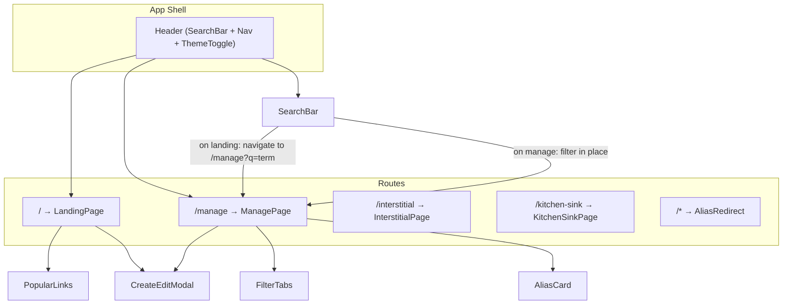
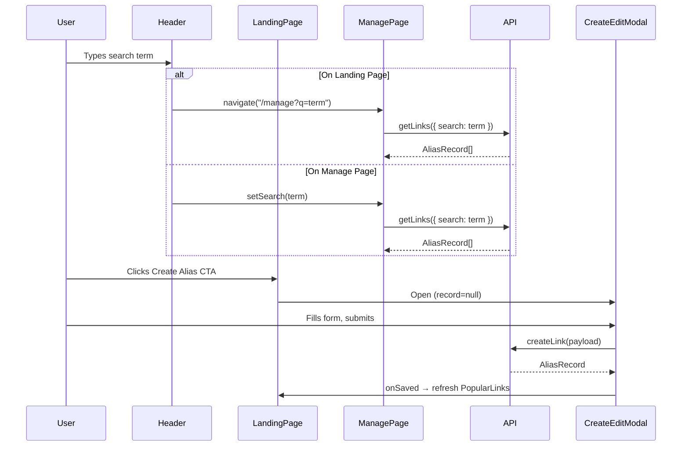

# Design Document: Landing Page Redesign

## Overview

This design restructures the Go URL alias service frontend from a single-page layout into a two-view architecture: a focused landing page (`/`) with a prominent Create Alias CTA and popular links, and a dedicated manage page (`/manage`) for full alias CRUD operations with filtering. The header is enhanced to house a global search bar and navigation link.

The redesign is purely a frontend concern. No API changes are required — the existing `getLinks`, `createLink`, `updateLink`, `deleteLink`, and `renewLink` endpoints already support all needed operations including search (`?search=`), popular scope (`?scope=popular`), and full CRUD.

### Key Design Decisions

1. **Client-side routing with React Router** — The app already uses `react-router-dom` v6 with `BrowserRouter`. We add a `/manage` route and restructure the existing `Dashboard` into two page components.
2. **Search state via URL search params** — Search terms are carried in the URL (`/manage?q=term`) so that navigating from the landing page search to the manage page preserves the query. This uses `useSearchParams` from React Router.
3. **Reuse existing components** — `PopularLinks`, `AliasCard`, `CreateEditModal`, `SearchBar`, `FilterTabs` logic, and `SkeletonLoader` are reused with minimal modification. The `SearchBar` component gains an optional `initialValue` prop and an `onSubmit` callback for cross-page navigation.
4. **No new API endpoints** — All data fetching uses the existing `getLinks` API with its `search`, `sort`, and `scope` query parameters.

## Architecture



### Data Flow



## Components and Interfaces

### Modified Components

#### `App` (src/App.tsx)

Restructured to render the `Header` with search and navigation, and route between `LandingPage` and `ManagePage`.

```typescript
// Route structure
<Header onSearch={handleSearch} />
<Routes>
  <Route path="/" element={<LandingPage />} />
  <Route path="/manage" element={<ManagePage />} />
  <Route path="/interstitial" element={<InterstitialPage />} />
  <Route path="/kitchen-sink" element={<KitchenSinkPage />} />
  <Route path="/*" element={<AliasRedirect />} />
</Routes>
```

#### `SearchBar` (src/components/SearchBar.tsx)

Enhanced with optional props for cross-page search:

```typescript
interface SearchBarProps {
  onSearch: (term: string) => void;
  onSubmit?: (term: string) => void; // NEW: called on Enter key
  initialValue?: string; // NEW: pre-populate from URL
  placeholder?: string;
}
```

- `onSubmit` is called when the user presses Enter. On the landing page, this triggers navigation to `/manage?q=term`.
- `initialValue` allows the manage page to seed the search bar from URL params.

### New Components

#### `LandingPage` (src/components/LandingPage.tsx)

Replaces the old `Dashboard` as the `/` route. Contains only the Create Alias CTA and `PopularLinks`.

```typescript
interface LandingPageProps {}

export function LandingPage(): JSX.Element;
// Internal state: showCreate (boolean), refreshKey (number)
// Renders: CTA button, PopularLinks, conditionally CreateEditModal
```

#### `ManagePage` (src/components/ManagePage.tsx)

The full alias management view at `/manage`. Absorbs the logic currently in `AliasListPage` and `Dashboard`.

```typescript
interface ManagePageProps {}

export function ManagePage(): JSX.Element;
// Reads search param "q" from URL via useSearchParams
// Internal state: records, loading, filter, editTarget, showCreate, deleteTarget
// Renders: FilterTabs, AliasCard list, CreateEditModal, delete confirmation dialog
```

#### `Header` (updated in App.tsx or extracted)

The persistent header rendered on all pages.

```typescript
// Rendered inside App, contains:
// - App title "Go"
// - SearchBar (with onSubmit for cross-page nav)
// - "Manage My Links" NavLink to /manage
// - ThemeToggle
```

### Component Hierarchy

```
App
├── Header
│   ├── AppTitle ("Go")
│   ├── SearchBar
│   ├── NavLink ("Manage My Links" → /manage)
│   └── ThemeToggle
├── Routes
│   ├── LandingPage (/)
│   │   ├── Create Alias CTA button
│   │   ├── PopularLinks
│   │   └── CreateEditModal (conditional)
│   ├── ManagePage (/manage)
│   │   ├── Toolbar (Create Alias button)
│   │   ├── FilterTabs
│   │   ├── AliasCard[] (filtered list)
│   │   ├── CreateEditModal (conditional)
│   │   └── Delete confirmation dialog (conditional)
│   ├── InterstitialPage (/interstitial)
│   └── KitchenSinkPage (/kitchen-sink)
```

## Data Models

No new data models are introduced. The existing `AliasRecord` interface from `src/services/api.ts` is used throughout. The search term is carried as a URL search parameter (`q`) rather than component state when navigating between pages.

### State Management

| State                              | Location                             | Purpose                             |
| ---------------------------------- | ------------------------------------ | ----------------------------------- |
| `search` (string)                  | URL param `q` on `/manage`           | Search term, synced to SearchBar    |
| `filter` (ExpiryFilter)            | ManagePage local state               | Active filter tab                   |
| `records` (AliasRecord[])          | ManagePage local state               | Fetched alias list                  |
| `showCreate` (boolean)             | LandingPage / ManagePage local state | Controls CreateEditModal visibility |
| `editTarget` (AliasRecord \| null) | ManagePage local state               | Alias being edited                  |
| `refreshKey` (number)              | LandingPage / ManagePage local state | Triggers data re-fetch              |

### Client-Side Filtering Logic

The `filterRecords` function applies the expiry status filter client-side after the API returns results:

```typescript
type ExpiryFilter = "all" | "active" | "expiring_soon" | "expired";

function filterRecords(
  records: AliasRecord[],
  filter: ExpiryFilter,
): AliasRecord[] {
  if (filter === "all") return records;
  return records.filter((r) => r.expiry_status === filter);
}
```

### Search Matching

Search is handled server-side by the existing `searchAliases` function in `cosmos-client.ts`, which performs case-insensitive matching against alias name, destination URL, and title. The frontend passes the search term to `getLinks({ search: term })`.

### Routing Configuration

The `staticwebapp.config.json` needs a new rewrite rule for `/manage`:

```json
{
  "route": "/manage",
  "rewrite": "/index.html"
}
```

This ensures direct navigation to `/manage` serves the SPA shell. The existing `navigationFallback` should handle this, but an explicit rule ensures it takes priority over the `/{alias}` redirect rule.

## Correctness Properties

_A property is a characteristic or behavior that should hold true across all valid executions of a system — essentially, a formal statement about what the system should do. Properties serve as the bridge between human-readable specifications and machine-verifiable correctness guarantees._

### Property 1: Filter tab produces correct subset

_For any_ list of `AliasRecord` objects and _for any_ selected expiry filter value from `{"all", "active", "expiring_soon", "expired"}`, applying the filter should return only records whose `expiry_status` matches the selected filter — or all records when the filter is `"all"`.

**Validates: Requirements 5.3**

### Property 2: Case-insensitive search matches alias, URL, and title

_For any_ `AliasRecord` and _for any_ non-empty search string, the record should be included in search results if and only if the search string appears (case-insensitively) as a substring of the record's `alias`, `destination_url`, or `title` fields.

**Validates: Requirements 7.3**

## Error Handling

| Scenario                                    | Handling                                                                       |
| ------------------------------------------- | ------------------------------------------------------------------------------ |
| `getLinks({ scope: "popular" })` fails      | PopularLinks shows toast error via `useToast`, renders empty state gracefully  |
| `getLinks({ search })` fails on ManagePage  | ManagePage shows toast error, preserves current filter tab state               |
| `createLink` fails                          | CreateEditModal shows toast error with API message, modal stays open for retry |
| `deleteLink` fails                          | ManagePage shows toast error, confirmation dialog closes, list unchanged       |
| `renewLink` fails                           | ManagePage shows toast error, alias card state unchanged                       |
| Invalid route `/manage?q=` (empty search)   | Treated as no search — ManagePage loads full list                              |
| Direct navigation to `/manage` without auth | SWA redirects to AAD login per existing `staticwebapp.config.json` rules       |

All error handling reuses the existing `ApiError` class and `useToast` hook. No new error handling patterns are introduced.

## Testing Strategy

### Unit Tests (Example-Based)

Unit tests cover specific interactions and rendering expectations:

- **LandingPage rendering**: CTA button present with `btn--primary` class, PopularLinks rendered, no FilterTabs or AliasCard list (Requirements 1.1, 1.2, 2.1)
- **CTA opens modal**: Clicking CTA opens CreateEditModal in create mode (Requirement 2.2)
- **Modal save refreshes popular links**: After successful save, modal closes and PopularLinks re-fetches (Requirement 2.3)
- **Header elements**: App title, SearchBar, "Manage My Links" link, ThemeToggle all present (Requirement 4.1)
- **Search from landing page navigates**: Typing a term and pressing Enter on landing page navigates to `/manage?q=term` (Requirements 4.4, 7.1)
- **ManagePage rendering**: FilterTabs with correct labels, alias cards, Create Alias button in toolbar (Requirements 5.1, 5.2, 5.7)
- **Edit/delete/renew interactions**: Edit opens modal with data, delete shows confirmation, renew calls API (Requirements 5.4, 5.5, 5.6)
- **Route mapping**: `/` renders LandingPage, `/manage` renders ManagePage, `/interstitial` renders InterstitialPage (Requirements 6.1–6.4)
- **Clear search restores list**: Clearing search on ManagePage shows unfiltered list for active tab (Requirement 7.4)
- **Error/edge cases**: API failure shows toast, empty popular links shows empty state message (Requirements 3.3, 3.4)

### Property-Based Tests

Property-based tests use `fast-check` (already in devDependencies) with a minimum of 100 iterations per property.

Each property test must be tagged with a comment referencing the design property:

- **Feature: landing-page-redesign, Property 1: Filter tab produces correct subset**
  - Generate arbitrary arrays of `AliasRecord` objects with random `expiry_status` values
  - Generate a random filter value from `{"all", "active", "expiring_soon", "expired"}`
  - Apply the `filterRecords` function
  - Assert: when filter is `"all"`, result equals input; otherwise, every record in the result has `expiry_status === filter` and no matching records from the input are missing

- **Feature: landing-page-redesign, Property 2: Case-insensitive search matches alias, URL, and title**
  - Generate arbitrary `AliasRecord` objects with random `alias`, `destination_url`, and `title` strings
  - Generate a random non-empty search substring
  - Apply the search matching function
  - Assert: a record is included if and only if `alias.toLowerCase()`, `destination_url.toLowerCase()`, or `title.toLowerCase()` contains `searchTerm.toLowerCase()`

### Test Configuration

- Framework: Vitest (already configured in `vite.config.ts`)
- Property testing library: `fast-check` v4 (already in `package.json` devDependencies)
- Minimum iterations: 100 per property test
- Test location: `src/components/__tests__/` for unit tests, `src/components/__tests__/` for property tests (co-located with frontend code)
