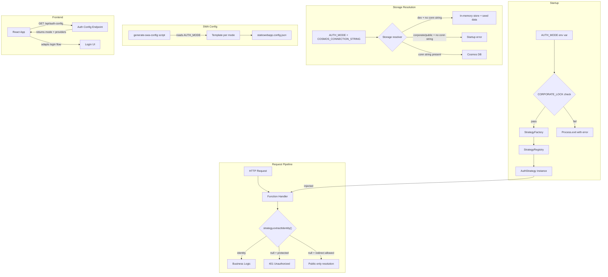

# Design Document: Multi-Tenant Auth Modes

## Overview

This design rearchitects the Go URL Alias Service's authentication layer from a binary `DEV_MODE` toggle into a strategy-pattern system supporting three deployment modes: `corporate`, `public`, and `dev`. A single `AUTH_MODE` environment variable selects the active strategy at startup. All strategies implement a shared `AuthStrategy` interface and are resolved via a `StrategyRegistry` + `StrategyFactory`, then injected into request handlers — eliminating scattered `DEV_MODE` conditionals throughout the codebase.

Key design goals:

- Single env var (`AUTH_MODE`) replaces `DEV_MODE` for all mode-dependent behavior
- Dependency injection replaces direct `createAuthProvider()` calls in handlers
- `CORPORATE_LOCK` safety mechanism prevents accidental misconfiguration
- SWA config generation per mode ensures route-level protections match the API layer
- Frontend adapts login flows and UI based on the active mode via a `/api/auth-config` endpoint

## Architecture



### Strategy Pattern

Each `AuthStrategy` implementation encapsulates:

1. **Identity extraction** — how to read the authenticated user from request headers
2. **Redirect auth requirement** — whether the `/{alias}` redirect endpoint requires authentication
3. **Identity provider metadata** — which providers are available (for frontend and SWA config)

The `StrategyFactory` is the single point where `AUTH_MODE` and `CORPORATE_LOCK` are evaluated. It runs once at startup and produces a frozen `AuthStrategy` instance that is passed to all handler registrations.

### Handler Refactoring

Currently, each handler calls `createAuthProvider()` inline. After refactoring, the startup code in `api/src/index.ts` will:

1. Run `StrategyFactory.create()` to get the `AuthStrategy`
2. Run storage resolution (Cosmos vs in-memory) based on `AUTH_MODE` and `COSMOS_CONNECTION_STRING`
3. Register each Azure Function handler with the resolved strategy injected via closure

This means handler functions become pure functions of `(request, context, strategy)` rather than reaching into global state.

## Components and Interfaces

### AuthStrategy Interface

```typescript
interface AuthStrategy {
  /** The active auth mode */
  readonly mode: AuthMode;

  /** Extract identity from request headers. Returns null if unauthenticated. */
  extractIdentity(headers: Record<string, string>): AuthIdentity | null;

  /** Whether the redirect endpoint requires authentication */
  readonly redirectRequiresAuth: boolean;

  /** Identity providers available in this mode (for frontend/SWA config) */
  readonly identityProviders: string[];
}

type AuthMode = "corporate" | "public" | "dev";

interface AuthIdentity {
  email: string;
  roles: string[];
}
```

### Strategy Implementations

**CorporateStrategy**

- `extractIdentity`: Decodes `x-ms-client-principal` Base64 header (existing `SwaAuthProvider` logic)
- `redirectRequiresAuth`: `true`
- `identityProviders`: `["aad"]`

**PublicStrategy**

- `extractIdentity`: Same as Corporate (SWA handles OAuth; the header format is identical regardless of provider)
- `redirectRequiresAuth`: `false`
- `identityProviders`: Read from `PUBLIC_AUTH_PROVIDERS` env var, default `["google"]`

**DevStrategy**

- `extractIdentity`: Reads `x-mock-user-email` header → `DEV_USER_EMAIL` env → `"dev@localhost"`. Reads `x-mock-user-roles` header → `DEV_USER_ROLES` env → `"User"`. Always returns non-null.
- `redirectRequiresAuth`: `false`
- `identityProviders`: `["dev"]`

### StrategyRegistry

```typescript
type StrategyConstructor = () => AuthStrategy;

const registry: Record<AuthMode, StrategyConstructor> = {
  corporate: () => new CorporateStrategy(),
  public: () => new PublicStrategy(),
  dev: () => new DevStrategy(),
};

function registerStrategy(mode: AuthMode, ctor: StrategyConstructor): void {
  registry[mode] = ctor;
}
```

The registry is a simple object mapping mode strings to factory functions. `registerStrategy` allows extending it without modifying existing code.

### StrategyFactory

```typescript
function createStrategy(): AuthStrategy {
  const mode = process.env.AUTH_MODE as AuthMode | undefined;
  const corporateLock = process.env.CORPORATE_LOCK === "true";

  // CORPORATE_LOCK is the very first check
  if (corporateLock && mode !== "corporate") {
    throw new Error(
      `CORPORATE_LOCK is enabled but AUTH_MODE is "${mode ?? "(not set)"}". ` +
        `Only "corporate" mode is allowed when CORPORATE_LOCK=true.`,
    );
  }

  if (!mode || !registry[mode]) {
    const valid = Object.keys(registry).join(", ");
    throw new Error(
      `Invalid or missing AUTH_MODE: "${mode ?? "(not set)"}". Must be one of: ${valid}`,
    );
  }

  return registry[mode]();
}
```

### Storage Resolution

Replace the scattered `useInMemory()` checks in `cosmos-client.ts` with a single startup decision:

```typescript
interface StorageConfig {
  useInMemory: boolean;
}

function resolveStorage(mode: AuthMode): StorageConfig {
  const hasCosmosConn = !!process.env.COSMOS_CONNECTION_STRING;

  if (mode === "dev" && !hasCosmosConn) {
    return { useInMemory: true };
  }

  if ((mode === "corporate" || mode === "public") && !hasCosmosConn) {
    throw new Error(
      `COSMOS_CONNECTION_STRING is required for AUTH_MODE="${mode}"`,
    );
  }

  return { useInMemory: false };
}
```

The resolved `StorageConfig` is passed to the cosmos-client module at startup, replacing all per-call `useInMemory()` checks.

### Redirect Handler Auth Logic

The redirect handler uses `strategy.redirectRequiresAuth` to branch:

```
if (strategy.redirectRequiresAuth):
  identity = strategy.extractIdentity(headers)
  if (!identity) → 401
  resolve private + global aliases (existing behavior)
else:
  identity = strategy.extractIdentity(headers)  // may be null
  if (identity):
    resolve private + global aliases (existing behavior)
  else:
    resolve ONLY global non-private aliases
    skip private alias lookup entirely
```

### Auth Config API Endpoint

New `GET /api/auth-config` endpoint (unauthenticated):

```typescript
// Returns:
{
  mode: "corporate" | "public" | "dev",
  identityProviders: string[],
  loginUrl: string  // e.g. "/.auth/login/aad" or "/.auth/login/google"
}
```

The frontend calls this on startup to determine which login flow to present.

### SWA Config Generation

A Node.js script `scripts/generate-swa-config.ts` reads `AUTH_MODE` (and `PUBLIC_AUTH_PROVIDERS` for public mode) and writes `staticwebapp.config.json` from templates:

- **Corporate template**: All routes require `authenticated` role, only AAD provider, block github/twitter/google, 401→AAD login redirect
- **Public template**: `/api/links` management routes require `authenticated`, `/{alias}` rewrite is open, configured providers enabled, others blocked, 401→primary provider login redirect
- **Dev template**: No `allowedRoles` on any route, all providers accessible

This script runs as a build step or deploy hook.

### Frontend Auth Adaptation

`src/services/api.ts` gets a new `getAuthConfig()` function. `src/App.tsx` calls it on mount and stores the result in React context. Components use this context to:

- **Corporate**: Show "Sign in with Microsoft" or auto-redirect to AAD
- **Public**: Show landing page with public links without auth; show "Sign in with Google/GitHub" when user tries to manage links
- **Dev**: Skip all login redirects, treat user as always authenticated

### File Changes Summary

| File                               | Change                                                                                                                      |
| ---------------------------------- | --------------------------------------------------------------------------------------------------------------------------- |
| `api/src/shared/auth-strategy.ts`  | NEW — `AuthStrategy` interface, `CorporateStrategy`, `PublicStrategy`, `DevStrategy`, `StrategyRegistry`, `StrategyFactory` |
| `api/src/shared/storage-config.ts` | NEW — `resolveStorage()` function                                                                                           |
| `api/src/shared/auth-provider.ts`  | DELETE — replaced by `auth-strategy.ts`                                                                                     |
| `api/src/shared/cosmos-client.ts`  | MODIFY — accept `StorageConfig` at init, remove `useInMemory()` and `DEV_MODE` checks                                       |
| `api/src/shared/seed-data.ts`      | MODIFY — called explicitly at startup when `useInMemory` is true, remove auto-import side effect                            |
| `api/src/index.ts`                 | MODIFY — orchestrate startup: factory → storage → seed → handler registration                                               |
| `api/src/functions/*.ts`           | MODIFY — accept `AuthStrategy` via closure instead of calling `createAuthProvider()`                                        |
| `api/src/functions/authConfig.ts`  | NEW — `GET /api/auth-config` endpoint                                                                                       |
| `scripts/generate-swa-config.ts`   | NEW — SWA config generation script                                                                                          |
| `src/services/api.ts`              | MODIFY — add `getAuthConfig()`                                                                                              |
| `src/App.tsx`                      | MODIFY — fetch auth config, provide via context                                                                             |
| `src/components/LandingPage.tsx`   | MODIFY — show public links without auth in public mode                                                                      |
| `src/components/ManagePage.tsx`    | MODIFY — prompt login when unauthenticated in public mode                                                                   |
| `.env.example`                     | MODIFY — replace `DEV_MODE` with `AUTH_MODE`, add `CORPORATE_LOCK`, `PUBLIC_AUTH_PROVIDERS`                                 |

## Data Models

### Environment Variables

| Variable                   | Values                                 | Default                           | Description                                   |
| -------------------------- | -------------------------------------- | --------------------------------- | --------------------------------------------- |
| `AUTH_MODE`                | `corporate`, `public`, `dev`           | _(required)_                      | Selects the active auth strategy              |
| `CORPORATE_LOCK`           | `true`, `false`                        | `false`                           | When `true`, only `corporate` mode is allowed |
| `PUBLIC_AUTH_PROVIDERS`    | Comma-separated (e.g. `google,github`) | `google`                          | Identity providers for public mode            |
| `COSMOS_CONNECTION_STRING` | Connection string                      | _(required for corporate/public)_ | Cosmos DB connection; optional in dev mode    |
| `DEV_USER_EMAIL`           | Email string                           | `dev@localhost`                   | Mock email for dev mode                       |
| `DEV_USER_ROLES`           | Comma-separated roles                  | `User`                            | Mock roles for dev mode                       |

### Auth Config Response

```typescript
interface AuthConfigResponse {
  mode: AuthMode;
  identityProviders: string[];
  loginUrl: string;
}
```

### SWA Config Templates

Each template is a complete `staticwebapp.config.json` structure. Key differences:

**Corporate**:

- `routes["/api/*"].allowedRoles = ["authenticated"]`
- `routes["/*"].allowedRoles = ["authenticated"]`
- `routes["/.auth/login/github"].statusCode = 404`
- `routes["/.auth/login/google"].statusCode = 404`
- `routes["/.auth/login/twitter"].statusCode = 404`
- `responseOverrides["401"].redirect = "/.auth/login/aad?post_login_redirect_uri=.referrer"`

**Public** (example with `google` provider):

- `routes["/api/links"].allowedRoles = ["authenticated"]` (POST/PUT/DELETE management routes)
- `routes["/{alias}"]` — no `allowedRoles` (open)
- `routes["/.auth/login/aad"].statusCode = 404`
- `routes["/.auth/login/twitter"].statusCode = 404`
- `responseOverrides["401"].redirect = "/.auth/login/google?post_login_redirect_uri=.referrer"`

**Dev**:

- No `allowedRoles` on any route
- All providers accessible (or irrelevant since auth is mocked)

### Existing Models (Unchanged)

The `AliasRecord`, `CreateAliasRequest`, `UpdateAliasRequest`, and `AuthIdentity` interfaces remain unchanged. The `AuthProvider` interface is replaced by `AuthStrategy` which extends it with `redirectRequiresAuth`, `mode`, and `identityProviders` properties.

## Correctness Properties

_A property is a characteristic or behavior that should hold true across all valid executions of a system — essentially, a formal statement about what the system should do. Properties serve as the bridge between human-readable specifications and machine-verifiable correctness guarantees._

### Property 1: Strategy factory mode resolution

_For any_ string value of `AUTH_MODE`, the `StrategyFactory` succeeds if and only if the value is one of `"corporate"`, `"public"`, or `"dev"`. When it succeeds, the returned strategy's `mode` property equals the input value. When it fails, a descriptive error is thrown.

**Validates: Requirements 1.1, 1.2, 1.3, 2.1, 2.2**

### Property 2: SWA header identity extraction round-trip

_For any_ valid `ClientPrincipal` object (with non-empty `userDetails` and an array of `userRoles`), Base64-encoding it and passing it to `CorporateStrategy.extractIdentity` (or `PublicStrategy.extractIdentity`) returns an `AuthIdentity` whose `email` equals `userDetails` and whose `roles` equals `userRoles`.

**Validates: Requirements 3.1, 4.3**

### Property 3: Invalid header returns null identity

_For any_ string that is not a valid Base64-encoded JSON object with a non-empty `userDetails` field, `CorporateStrategy.extractIdentity` and `PublicStrategy.extractIdentity` return `null`. Additionally, when the header is missing entirely, both return `null`.

**Validates: Requirements 3.2, 4.4**

### Property 4: Dev strategy identity priority chain

_For any_ combination of `x-mock-user-email` header value (present or absent), `DEV_USER_EMAIL` env var (present or absent), and default `"dev@localhost"`, the `DevStrategy` returns the email from the highest-priority non-empty source (header > env > default). The same priority applies to roles via `x-mock-user-roles` header, `DEV_USER_ROLES` env var, and default `"User"`.

**Validates: Requirements 5.1, 5.2**

### Property 5: Dev strategy always returns non-null identity

_For any_ set of request headers (including an empty header map), `DevStrategy.extractIdentity` returns a non-null `AuthIdentity` with a non-empty email and at least one role.

**Validates: Requirements 5.3**

### Property 6: Protected endpoints reject unauthenticated requests

_For any_ protected endpoint (create, update, delete, list links) and _for any_ request that produces a `null` identity from the active `AuthStrategy`, the handler returns HTTP 401.

**Validates: Requirements 4.7, 4.8, 4.9, 4.10**

### Property 7: Redirect endpoint enforces auth when strategy requires it

_For any_ `AuthStrategy` where `redirectRequiresAuth` is `true` and _for any_ request that produces a `null` identity, the redirect handler returns HTTP 401.

**Validates: Requirements 3.7, 7.2**

### Property 8: Unauthenticated redirect resolves only public aliases

_For any_ `AuthStrategy` where `redirectRequiresAuth` is `false`, and _for any_ unauthenticated request (null identity), and _for any_ alias value: if a public (non-private) alias record exists, the redirect handler resolves it with a 302. If only a private alias record exists, the redirect handler treats it as not found (redirects to the landing page with a suggest parameter). Private alias lookup is skipped entirely.

**Validates: Requirements 4.5, 4.6, 7.3, 7.4**

### Property 9: Authenticated redirect in open mode resolves all aliases

_For any_ `AuthStrategy` where `redirectRequiresAuth` is `false`, and _for any_ authenticated request (non-null identity), and _for any_ alias value: the redirect handler resolves both private and public aliases using the same logic as the fully-authenticated corporate mode.

**Validates: Requirements 7.5**

### Property 10: Corporate lock enforcement

_For any_ combination of `CORPORATE_LOCK` and `AUTH_MODE` values, the `StrategyFactory` throws if and only if `CORPORATE_LOCK` is `"true"` and `AUTH_MODE` is not `"corporate"`. When `CORPORATE_LOCK` is not `"true"`, any valid `AUTH_MODE` is accepted.

**Validates: Requirements 10.2, 10.4**

### Property 11: Storage resolution correctness

_For any_ `AUTH_MODE` and `COSMOS_CONNECTION_STRING` combination: when mode is `"dev"` and no connection string is set, `resolveStorage` returns `{ useInMemory: true }`. When mode is `"corporate"` or `"public"` and no connection string is set, `resolveStorage` throws a descriptive error. When a connection string is present (any mode), `resolveStorage` returns `{ useInMemory: false }`.

**Validates: Requirements 6.1, 6.3, 6.4**

### Property 12: SWA config provider enablement

_For any_ set of identity providers in the `PUBLIC_AUTH_PROVIDERS` list, the generated public-mode SWA config enables exactly those providers (no 404 block) and blocks all known providers not in the list with a 404 status code.

**Validates: Requirements 4.1, 4.11, 4.12**

### Property 13: SWA config 401 redirect targets primary provider

_For any_ configured primary identity provider in public mode, the generated SWA config's `responseOverrides["401"]` redirect URL points to `/.auth/login/{primaryProvider}`.

**Validates: Requirements 8.3**

## Error Handling

### Startup Errors

| Condition                                                          | Behavior                                                                                          |
| ------------------------------------------------------------------ | ------------------------------------------------------------------------------------------------- |
| `CORPORATE_LOCK=true` and `AUTH_MODE` ≠ `corporate`                | Throw with message identifying the lock conflict. This is checked before any other startup logic. |
| `AUTH_MODE` missing or unrecognized                                | Throw with message listing valid values (`corporate`, `public`, `dev`).                           |
| `COSMOS_CONNECTION_STRING` missing in `corporate` or `public` mode | Throw with message indicating the connection string is required for the active mode.              |

All startup errors prevent the Azure Functions host from registering any handlers, ensuring no requests are served in a misconfigured state.

### Runtime Errors

| Condition                                             | Behavior                                                                                         |
| ----------------------------------------------------- | ------------------------------------------------------------------------------------------------ |
| `x-ms-client-principal` header missing or malformed   | `extractIdentity` returns `null`. Handler returns 401 for protected endpoints.                   |
| Cosmos DB connection failure                          | Handler catches and returns 500 with generic error message. Logged to `InvocationContext`.       |
| Invalid request body (malformed JSON, missing fields) | Handler returns 400 with specific validation error.                                              |
| Alias not found                                       | Handler returns 404 or redirects to landing page with `?suggest=` parameter (redirect endpoint). |
| Authorization failure (not owner, not admin)          | Handler returns 403.                                                                             |

### SWA Config Generation Errors

| Condition                                               | Behavior                                                                |
| ------------------------------------------------------- | ----------------------------------------------------------------------- |
| `AUTH_MODE` not set when running generation script      | Script exits with error message.                                        |
| `PUBLIC_AUTH_PROVIDERS` contains unknown provider names | Script logs a warning but proceeds (SWA will handle unknown providers). |

## Testing Strategy

### Property-Based Testing

Property-based tests use `fast-check` (already in `devDependencies`) with a minimum of 100 iterations per property. Each test is tagged with a comment referencing the design property.

Tag format: `Feature: multi-tenant-auth-modes, Property {N}: {title}`

Properties to implement as PBT:

| Property                                      | Test File                         | What It Generates                                                  |
| --------------------------------------------- | --------------------------------- | ------------------------------------------------------------------ |
| P1: Strategy factory mode resolution          | `auth-strategy.property.ts`       | Random strings (valid + invalid AUTH_MODE values)                  |
| P2: SWA header identity extraction round-trip | `auth-strategy.property.ts`       | Random ClientPrincipal objects → Base64 encode → extract           |
| P3: Invalid header returns null               | `auth-strategy.property.ts`       | Random non-Base64 strings, empty strings, malformed JSON           |
| P4: Dev strategy priority chain               | `auth-strategy.property.ts`       | Random combinations of header/env/default presence                 |
| P5: Dev strategy always non-null              | `auth-strategy.property.ts`       | Random header maps                                                 |
| P6: Protected endpoints reject unauth         | `protected-endpoints.property.ts` | Random request bodies × null identity                              |
| P7: Redirect auth enforcement                 | `redirect-auth.property.ts`       | Random alias values × null identity × redirectRequiresAuth=true    |
| P8: Unauth redirect resolves only public      | `redirect-auth.property.ts`       | Random alias records (private/public) × null identity              |
| P9: Auth redirect in open mode                | `redirect-auth.property.ts`       | Random alias records × valid identity × redirectRequiresAuth=false |
| P10: Corporate lock enforcement               | `auth-strategy.property.ts`       | Random CORPORATE_LOCK × AUTH_MODE combinations                     |
| P11: Storage resolution                       | `storage-config.property.ts`      | Random AUTH_MODE × COSMOS_CONNECTION_STRING combinations           |
| P12: SWA config provider enablement           | `swa-config.property.ts`          | Random subsets of known providers                                  |
| P13: SWA config 401 redirect                  | `swa-config.property.ts`          | Random primary provider names                                      |

Each correctness property MUST be implemented by a single property-based test.

### Unit Testing

Unit tests complement property tests by covering specific examples, edge cases, and integration points:

- **Strategy factory**: Verify each mode returns the correct strategy class instance. Verify error messages are descriptive.
- **Corporate lock**: Verify the exact error message when lock is violated. Verify lock check runs before mode validation.
- **SWA config generation**: Snapshot tests for each mode's generated config. Verify corporate config matches the current `staticwebapp.config.json`.
- **Redirect handler**: Integration test with mock strategy injection — verify interstitial, expired, and not-found flows still work.
- **Auth config endpoint**: Verify response shape for each mode.
- **DEV_MODE removal**: Grep-based test asserting zero occurrences of `DEV_MODE` in `api/src/`.
- **Frontend auth context**: Verify the React context provides correct values for each mode.

### Test Configuration

- Test runner: Vitest (already configured in `api/vitest.config.ts`)
- PBT library: `fast-check` (already in `api/package.json` devDependencies)
- Property test files: `api/tests/property/auth-strategy.property.ts`, `api/tests/property/protected-endpoints.property.ts`, `api/tests/property/redirect-auth.property.ts`, `api/tests/property/storage-config.property.ts`, `api/tests/property/swa-config.property.ts`
- Unit test files: `api/tests/unit/auth-strategy.test.ts`, `api/tests/unit/swa-config.test.ts`, `api/tests/unit/redirect-auth.test.ts`
- Minimum 100 iterations per property test (`{ numRuns: 100 }`)
