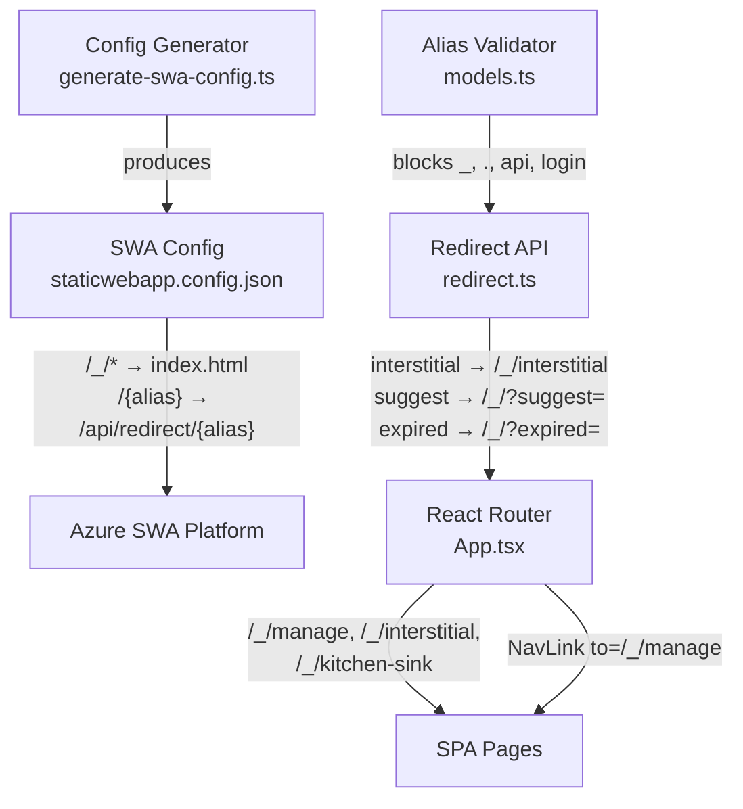

# Design Document: Route Prefix Namespacing

## Overview

This design moves all SPA page routes under a `/_/` prefix to create a clean two-tier routing model in Azure Static Web Apps (SWA):

1. `/_/*` → SPA pages (served via `index.html`)
2. `/{alias}` → redirect API (catch-all)

Currently, individual SPA routes (`/manage`, `/interstitial`, `/kitchen-sink`) must be listed as explicit rewrite rules *before* the `/{alias}` catch-all in `staticwebapp.config.json`. This is fragile — adding a new page requires updating the SWA config, and any ordering mistake causes the redirect API to intercept app pages.

By namespacing under `/_/`, the SWA config becomes order-independent for app routes. The `/_/*` pattern is excluded from the navigation fallback, and the `/{alias}` catch-all can never match an app page because aliases are validated to never start with `_`.

The landing page (`/`) and login redirect (`/login`) remain unprefixed. The `/api/*` and `/.auth/*` prefixes are hardcoded by Azure SWA and are untouched.

### Key Design Decisions

- **`/_/` prefix chosen over `/app/`**: The underscore prefix is a common convention for internal/system routes and is visually distinct. It also cannot collide with valid aliases since we enforce alphanumeric-start validation.
- **No redirect from old paths**: Old paths like `/manage` will simply fall through to the `/{alias}` catch-all and get a "suggest" redirect. This is intentional — no legacy redirect rules are needed.
- **Alias validation tightened at the model layer**: The `validateAlias` function in `models.ts` gains alphanumeric-start enforcement and reserved-name blocking, preventing any future alias from colliding with system routes.

## Architecture

The change touches four layers of the stack:



### Route Resolution Order (Production)

1. `/api/*` — Azure Functions (hardcoded by SWA)
2. `/.auth/*` — SWA auth flows (hardcoded by SWA)
3. `/login` — redirect to `/.auth/login/{provider}`
4. `/_/manage`, `/_/interstitial`, `/_/kitchen-sink` — rewrite to `/index.html`
5. `/{alias}` — rewrite to `/api/redirect/{alias}`
6. `/` — navigation fallback to `/index.html`

### Route Resolution Order (Development)

Vite dev server handles `/_/*` paths via its default SPA fallback (serves `index.html` for any path not matching a file). No additional proxy config is needed for `/_/` routes.

## Components and Interfaces

### 1. SWA Config (`staticwebapp.config.json`)

**Current state**: Individual page routes listed before `/{alias}` catch-all.

**New state**: Page routes use `/_/` prefix. The `navigationFallback.exclude` array gains `/_/*`.

```json
{
  "routes": [
    { "route": "/.auth/login/github", "statusCode": 404 },
    { "route": "/.auth/login/twitter", "statusCode": 404 },
    { "route": "/.auth/login/google", "statusCode": 404 },
    { "route": "/login", "redirect": "/.auth/login/aad?post_login_redirect_uri=.referrer" },
    { "route": "/api/*", "allowedRoles": ["authenticated"] },
    { "route": "/_/manage", "rewrite": "/index.html" },
    { "route": "/_/interstitial", "rewrite": "/index.html" },
    { "route": "/_/kitchen-sink", "rewrite": "/index.html" },
    { "route": "/{alias}", "rewrite": "/api/redirect/{alias}" },
    { "route": "/*", "allowedRoles": ["authenticated"] }
  ],
  "navigationFallback": {
    "rewrite": "/index.html",
    "exclude": ["/api/*", "/.auth/*", "/_/*"]
  }
}
```

### 2. Config Generator (`scripts/generate-swa-config.ts`)

**Changes**:
- `pageRewrites()` function updated to return `/_/`-prefixed routes
- `baseNavigationFallback()` updated to include `/_/*` in the exclude array
- All three auth modes (corporate, public, dev) produce the same prefixed routes

**Interface** (unchanged):
```typescript
function generateSwaConfig(mode: AuthMode, providers?: string[]): SwaConfig;
```

The `pageRewrites()` helper becomes:
```typescript
function pageRewrites(): SwaRoute[] {
  return [
    { route: "/_/interstitial", rewrite: "/index.html" },
    { route: "/_/kitchen-sink", rewrite: "/index.html" },
    { route: "/_/manage", rewrite: "/index.html" },
  ];
}
```

### 3. React Router (`src/App.tsx`)

**Changes**:
- Route definitions updated from `/manage` → `/_/manage`, `/interstitial` → `/_/interstitial`, `/kitchen-sink` → `/_/kitchen-sink`
- `NavLink` targets updated to `/_/manage`
- `isAppRoute` check updated to match `/_/`-prefixed paths
- `handleHeaderSearch` and `handleHeaderSubmit` navigate to `/_/manage?q=...`
- `isManagePage` check updated to `/_/manage`

**Route table**:
```typescript
<Routes>
  <Route path="/" element={<LandingPage />} />
  <Route path="/_/manage" element={<ManagePage />} />
  <Route path="/_/interstitial" element={<InterstitialPage />} />
  <Route path="/_/kitchen-sink" element={<KitchenSinkPage />} />
  <Route path="/*" element={<AliasRedirect />} />
</Routes>
```

### 4. Redirect API (`api/src/functions/redirect.ts`)

**Changes**:
- Interstitial redirect URL: `/interstitial?...` → `/_/interstitial?...`
- Suggest redirect URL: `/?suggest=...` → `/_/?suggest=...`
- Expired redirect URL: `/?expired=...` → `/_/?expired=...`

**No interface changes** — the function signature and HTTP binding remain the same.

### 5. Alias Validator (`api/src/shared/models.ts`)

**Changes**:
- `ALIAS_PATTERN` updated to enforce alphanumeric first character: `/^[a-z0-9][a-z0-9-]*$/`
- New `RESERVED_NAMES` set: `{"api", "login"}`
- `validateAlias()` gains reserved-name and prefix checks

**Updated interface**:
```typescript
function validateAlias(alias: string): ValidationResult;
// Now also rejects: aliases starting with _ or ., reserved names "api" and "login"
```

### 6. Vite Config (`vite.config.ts`)

**No changes required**. The existing Vite dev server already serves `index.html` for any path that doesn't match a static file or proxy rule. Paths like `/_/manage` will naturally fall through to the SPA. The `/api` and `/go-redirect` proxy rules remain unchanged.

## Data Models

No data model changes are required. The `AliasRecord` interface and Cosmos DB schema remain unchanged.

The only data-adjacent change is the alias validation regex, which constrains the *format* of the `alias` field but does not alter its type or storage:

| Constraint | Current | New |
|---|---|---|
| Pattern | `/^[a-z0-9-]+$/` | `/^[a-z0-9][a-z0-9-]*$/` |
| Reserved names | None | `api`, `login` |
| Prefix block | None | `_`, `.` (covered by alphanumeric-start rule) |

Existing aliases in the database that start with `_`, `.`, or match reserved names will continue to function for redirects but cannot be created going forward. No migration is needed.

## Correctness Properties

*A property is a characteristic or behavior that should hold true across all valid executions of a system — essentially, a formal statement about what the system should do. Properties serve as the bridge between human-readable specifications and machine-verifiable correctness guarantees.*

### Property 1: Generated config app routes use `/_/` prefix

*For any* auth mode (corporate, public, dev) and any valid provider list, calling `generateSwaConfig()` should produce a routes array where every SPA page rewrite route (manage, interstitial, kitchen-sink) has a `/_/` prefix and rewrites to `/index.html`.

**Validates: Requirements 1.1, 2.1**

### Property 2: Alias catch-all appears after all prefixed app routes

*For any* auth mode and provider list, in the routes array produced by `generateSwaConfig()`, the index of the `/{alias}` rewrite rule should be greater than the index of every `/_/`-prefixed route.

**Validates: Requirements 1.2, 2.2**

### Property 3: Navigation fallback excludes `/_/*`

*For any* auth mode and provider list, the `navigationFallback.exclude` array produced by `generateSwaConfig()` should contain `/_/*` alongside `/api/*` and `/.auth/*`.

**Validates: Requirements 2.3**

### Property 4: Login route remains unprefixed

*For any* auth mode and provider list, the generated config should contain a `/login` route (not `/_/login`) that redirects to a `/.auth/login/` provider endpoint.

**Validates: Requirements 1.4**

### Property 5: Redirect API fallback URLs use `/_/` base path

*For any* alias name, when the redirect handler produces a fallback response (interstitial conflict, suggest for not-found, or expired), the `location` header should start with `/_/`.

**Validates: Requirements 4.3, 4.4, 8.1, 8.2, 8.3**

### Property 6: Alias validation enforces alphanumeric start and valid characters

*For any* string, if it starts with a lowercase letter or digit and contains only lowercase alphanumeric characters and hyphens, and is not a reserved name, then `validateAlias()` should return `{ valid: true }`. *For any* string that starts with a non-alphanumeric character (hyphen, underscore, period, uppercase, etc.) or contains invalid characters, `validateAlias()` should return `{ valid: false }` with the message "Alias must start with a letter or digit and contain only lowercase alphanumeric characters and hyphens".

**Validates: Requirements 5.1, 5.2, 5.3, 5.4**

### Property 7: Reserved alias names are rejected with specific error

*For any* alias name that exactly matches a reserved name (`api`, `login`), `validateAlias()` should return `{ valid: false }` with the message "This alias name is reserved and cannot be used".

**Validates: Requirements 6.1, 6.4**

## Error Handling

### Alias Validation Errors

The `validateAlias()` function returns structured `ValidationResult` objects. Two new error paths are added:

| Condition | Error Message |
|---|---|
| Alias starts with non-alphanumeric character or contains invalid chars | "Alias must start with a letter or digit and contain only lowercase alphanumeric characters and hyphens" |
| Alias matches a reserved name (`api`, `login`) | "This alias name is reserved and cannot be used" |

These errors surface as HTTP 400 responses from the `createLink` and `updateLink` API endpoints, which already call `validateAlias()` as part of request validation.

### Redirect Fallback Behavior

When the redirect API cannot resolve an alias, it returns HTTP 302 redirects to the SPA:

| Condition | Redirect Target |
|---|---|
| No alias found | `/_/?suggest={alias}` |
| All matches expired | `/_/?expired={alias}` |
| Private + global conflict | `/_/interstitial?alias={alias}&privateUrl=...&globalUrl=...` |

No new error conditions are introduced. The redirect handler's existing try/catch for database errors and unexpected exceptions remains unchanged.

### Old Route Handling

Requests to old unprefixed paths (e.g., `/manage`) will match the `/{alias}` catch-all in SWA config and be rewritten to `/api/redirect/manage`. Since no alias named "manage" exists, the redirect API will return a 302 to `/_/?suggest=manage`. This is acceptable degradation — no explicit error handling is needed.

## Testing Strategy

### Unit Tests

Unit tests cover specific examples and edge cases:

- **Config generator**: Snapshot tests for each auth mode verifying the exact structure of generated `staticwebapp.config.json`
- **Alias validation**: Example tests for reserved names (`api`, `login`), edge cases (aliases starting with `_`, `.`, `-`), and valid aliases
- **Redirect handler**: Example tests for interstitial, suggest, and expired redirect URLs containing `/_/` prefix
- **React Router**: Component tests verifying that `/_/manage`, `/_/interstitial`, and `/_/kitchen-sink` render the correct components

### Property-Based Tests

Property-based tests verify universal properties across generated inputs. Use `fast-check` (already available in the project's test dependencies).

Each property test must:
- Run a minimum of 100 iterations
- Reference the design property with a tag comment
- Use a single property-based test per correctness property

| Property | Test Description | Library |
|---|---|---|
| Property 1 | Generate random auth modes, verify all app routes have `/_/` prefix | fast-check |
| Property 2 | Generate random auth modes, verify `/{alias}` index > all `/_/` route indices | fast-check |
| Property 3 | Generate random auth modes, verify `/_/*` in navigationFallback.exclude | fast-check |
| Property 4 | Generate random auth modes, verify `/login` route exists without `/_/` prefix | fast-check |
| Property 5 | Generate random alias names, mock DB responses for not-found/expired/conflict, verify redirect location starts with `/_/` | fast-check |
| Property 6 | Generate random strings, verify validateAlias accepts/rejects correctly based on first character and character set | fast-check |
| Property 7 | Generate aliases from the reserved names set, verify rejection with correct error message | fast-check |

**Tag format**: `Feature: route-prefix-namespacing, Property {N}: {title}`

Example:
```typescript
// Feature: route-prefix-namespacing, Property 6: Alias validation enforces alphanumeric start and valid characters
it.prop([fc.string()], (input) => {
  const result = validateAlias(input);
  // ... assertions
});
```
