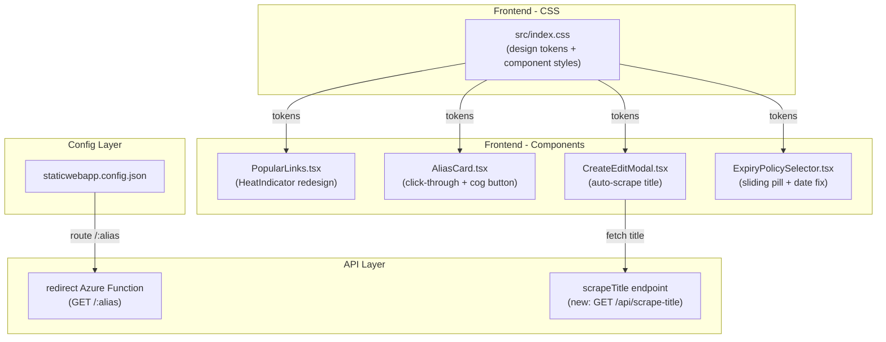

# Design Document: UI/UX Improvements

## Overview

This design covers eight UI/UX improvements and bug fixes for the Go URL alias service. The changes span three categories:

1. **Routing fix**: Updating `staticwebapp.config.json` so that `/:alias` paths hit the Azure Function redirect endpoint instead of falling through to the SPA navigation fallback.
2. **Visual/interaction redesigns**: Heat indicator from signal bars to horizontal popularity bar, link card click-through navigation with separate cog/edit button, corporate grey background with geometric pattern, glow effects on all interactive elements, and sliding pill design for the expiry policy selector.
3. **Functional improvements**: Auto-scraping page title from destination URL with debounce and manual override, and fixing the date picker so selecting a date correctly populates the custom expiry field.

The routing fix is a config-only change. The visual changes are primarily CSS with minor JSX updates to `PopularLinks`, `AliasCard`, and `ExpiryPolicySelector`. The auto-scrape feature adds a new API utility function and state management in `CreateEditModal`. The date picker fix is a small logic correction in `ExpiryPolicySelector`.

## Architecture



### Change Summary by File

| File                                      | Change Type                                              | Requirements   |
| ----------------------------------------- | -------------------------------------------------------- | -------------- |
| `staticwebapp.config.json`                | Config: add route rule for `/:alias` → API               | Req 1          |
| `src/index.css`                           | CSS: background, glow, heat bar, pill styles             | Req 2, 4, 5, 6 |
| `src/components/PopularLinks.tsx`         | JSX: replace signal bars with horizontal bar             | Req 2, 3.2     |
| `src/components/AliasCard.tsx`            | JSX: wrap body in anchor, add cog edit button, show icon | Req 3, 7       |
| `src/components/CreateEditModal.tsx`      | JSX: auto-scrape title + icon logic                      | Req 7          |
| `src/components/ExpiryPolicySelector.tsx` | JSX: sliding pill + date picker fix                      | Req 6, 8       |
| `src/services/api.ts`                     | TS: add `scrapeMetadata` API function                    | Req 7          |
| `api/src/functions/scrapeTitle.ts`        | TS: new Azure Function for title+icon scraping           | Req 7          |
| `api/src/shared/models.ts`                | TS: add `icon_url` to AliasRecord + requests             | Req 7          |

## Components and Interfaces

### Requirement 1: Static Web App Config Route

The current `staticwebapp.config.json` has a `navigationFallback` that rewrites all non-API, non-auth paths to `/index.html`. This means `/:alias` paths are served by the SPA instead of the redirect Azure Function.

The fix adds a specific route rule before the catch-all that forwards `/:alias` patterns to the API:

```json
{
  "route": "/{alias}",
  "rewrite": "/api/redirect/{alias}"
}
```

This rule must be placed before the `"/*"` catch-all route. The `navigationFallback.exclude` array already excludes `/api/*`, so the rewritten path will reach the Azure Function. Known SPA routes (`/`, `/interstitial`, `/kitchen-sink`) need explicit rules to prevent them from being caught by the alias route:

```json
{ "route": "/interstitial", "rewrite": "/index.html" },
{ "route": "/kitchen-sink", "rewrite": "/index.html" }
```

The redirect Azure Function already handles all resolution logic (private/global lookup, expiry checks, interstitial redirect, analytics). No API changes needed for this requirement.

### Requirement 2: Heat Indicator Redesign

Replace the `HeatIndicator` component in `PopularLinks.tsx`. Current implementation renders 5 vertical bars (signal-bar style). New implementation renders a single horizontal progress bar.

```tsx
function HeatIndicator({ score, max }: { score: number; max: number }) {
  const percentage = max > 0 ? Math.round((score / max) * 100) : 0;
  const level = max > 0 ? Math.ceil((score / max) * 5) : 0;
  return (
    <div
      className="heat-bar"
      role="meter"
      aria-valuenow={percentage}
      aria-valuemin={0}
      aria-valuemax={100}
      aria-label={`Popularity: ${level} of 5`}
    >
      <div className="heat-bar__fill" style={{ width: `${percentage}%` }} />
    </div>
  );
}
```

CSS for the heat bar:

```css
.heat-bar {
  width: 80px;
  height: 8px;
  background: var(--color-border);
  border-radius: 4px;
  overflow: hidden;
  flex-shrink: 0;
}

.heat-bar__fill {
  height: 100%;
  background: linear-gradient(90deg, var(--color-primary), var(--color-accent));
  border-radius: 4px;
  transition: width var(--transition-speed) ease;
}
```

The old `.heat-indicator` CSS classes are removed.

### Requirement 3: Link Card Click-Through Navigation

**AliasCard changes:**

The card body becomes clickable, opening the destination URL in a new tab. The Edit button changes from a text button to a cog icon button positioned in the card header. Click events on the cog button call `e.stopPropagation()` to prevent the card click-through.

```tsx
// Simplified structure
<article
  className={cardClass}
  onClick={() => window.open(record.destination_url, "_blank")}
  style={{ cursor: "pointer" }}
>
  <div className="alias-card__header">
    <div className="alias-card__title-row">
      <span className="alias-card__alias">go/{record.alias}</span>
      {/* badges */}
      <button
        className="alias-card__btn alias-card__btn--icon"
        onClick={(e) => {
          e.stopPropagation();
          onEdit(record);
        }}
        aria-label={`Edit ${record.alias}`}
      >
        ⚙️
      </button>
    </div>
  </div>
  {/* rest of card content */}
  <div className="alias-card__actions" onClick={(e) => e.stopPropagation()}>
    {/* Delete, Renew buttons remain */}
  </div>
</article>
```

**PopularLinks item changes:**

Each `popular-links__item` becomes an anchor element (`<a>`) wrapping the content, opening the destination URL in a new tab:

```tsx
<a
  key={link.id}
  href={link.destination_url}
  target="_blank"
  rel="noopener noreferrer"
  className="popular-links__item glass"
>
  {/* existing content */}
</a>
```

The `<li>` wrapper moves outside the `<a>` or the `<a>` replaces the `<li>` with appropriate list semantics maintained via `role="listitem"`.

### Requirement 4: Corporate Background Theme

Replace the coloured gradient background with a flat grey base plus a subtle CSS geometric pattern.

**Light theme:**

```css
[data-theme="light"] {
  --color-bg: #e8eaed;
  --color-bg-gradient: none;
  --color-bg-pattern: radial-gradient(
    circle,
    rgba(0, 0, 0, 0.04) 1px,
    transparent 1px
  );
  --color-bg-pattern-size: 20px 20px;
}
```

**Dark theme:**

```css
[data-theme="dark"] {
  --color-bg: #1a1d23;
  --color-bg-gradient: none;
  --color-bg-pattern: radial-gradient(
    circle,
    rgba(255, 255, 255, 0.03) 1px,
    transparent 1px
  );
  --color-bg-pattern-size: 20px 20px;
}
```

**Body styles:**

```css
body {
  background-color: var(--color-bg);
  background-image: var(--color-bg-pattern);
  background-size: var(--color-bg-pattern-size);
  background-attachment: fixed;
}
```

The dot grid pattern is low-contrast (4% opacity light, 3% opacity dark) so it doesn't compete with content. All existing glassmorphism surface styles (`.glass`, `.glass--subtle`) remain unchanged and layer on top of the new background. WCAG AA contrast ratios are maintained: `#1e293b` on `#e8eaed` = ~11.2:1 (light), `#e2e8f0` on `#1a1d23` = ~13.1:1 (dark).

### Requirement 5: Glow Effect on Interactive Elements

Extend the existing primary button glow to all interactive elements. Define a shared glow custom property:

```css
:root {
  --glow-shadow: 0 0 16px rgba(14, 165, 233, 0.25);
  --glow-shadow-subtle: 0 0 12px rgba(14, 165, 233, 0.15);
}
```

Apply to:

- `.btn:hover` — `box-shadow: var(--glow-shadow-subtle)`
- `.filter-tabs__tab:hover` — `box-shadow: var(--glow-shadow-subtle)`
- `.glass:hover` — `box-shadow: var(--glass-shadow), var(--glow-shadow-subtle)`
- `.scope-toggle__option--active` — glow on the slider element
- `:focus-visible` — `outline` plus `box-shadow: var(--glow-shadow)`

For `prefers-reduced-motion`, suppress glow transition animations (instant apply, no transition on box-shadow):

```css
@media (prefers-reduced-motion: reduce) {
  .btn,
  .filter-tabs__tab,
  .glass,
  .scope-toggle__slider {
    transition: none !important;
  }
}
```

### Requirement 6: Sliding Pill for Expiry Policy Selector

Refactor `ExpiryPolicySelector` to use the same sliding pill pattern as `ScopeToggle`. The component needs two pill toggles:

1. **Expiry type pill** (3 options: Never, Expire on date, After inactivity)
2. **Duration pill** (3 options: 1 month, 3 months, 12 months) — shown only when type is "fixed" and custom date is not selected

The slider width calculation changes from 50% (2 options) to 33.33% (3 options), and the `translateX` is computed based on the selected index:

```tsx
// Slider transform for 3-option pill
const typeIndex = ["never", "fixed", "inactivity"].indexOf(
  value.expiry_policy_type,
);
const typeTransform = `translateX(${typeIndex * 100}%)`;
```

CSS additions:

```css
.expiry-pill {
  display: flex;
  position: relative;
  border-radius: var(--radius);
  padding: 4px;
  overflow: hidden;
}

.expiry-pill__option {
  flex: 1;
  /* same styles as scope-toggle__option */
}

.expiry-pill__slider {
  position: absolute;
  top: 4px;
  left: 4px;
  width: calc(33.333% - 4px);
  height: calc(100% - 8px);
  background: var(--color-primary);
  border-radius: calc(var(--radius) - 4px);
  transition: transform 0.25s cubic-bezier(0.4, 0, 0.2, 1);
}
```

Keyboard navigation: arrow keys cycle through options within each pill group, matching `ScopeToggle` behaviour. `role="radiogroup"` and `role="radio"` with `aria-checked` are maintained.

### Requirement 7: Auto-Scrape Page Title and Icon

**New API endpoint**: `GET /api/scrape-title?url={encodedUrl}`

A lightweight Azure Function that fetches the target URL, extracts the `<title>` tag content and the favicon/icon URL, and returns both as JSON:

```ts
// api/src/functions/scrapeTitle.ts
export async function scrapeTitleHandler(req, context) {
  const url = req.query.get("url");
  if (!url)
    return { status: 400, jsonBody: { error: "url parameter required" } };

  try {
    const response = await fetch(url, {
      headers: { "User-Agent": "GoLinkBot/1.0" },
      signal: AbortSignal.timeout(5000),
    });
    const html = await response.text();
    const titleMatch = html.match(/<title[^>]*>([^<]+)<\/title>/i);

    // Extract icon: check <link rel="icon"> or <link rel="shortcut icon">, fall back to /favicon.ico
    const iconMatch =
      html.match(
        /<link[^>]*rel=["'](?:shortcut )?icon["'][^>]*href=["']([^"']+)["']/i,
      ) ||
      html.match(
        /<link[^>]*href=["']([^"']+)["'][^>]*rel=["'](?:shortcut )?icon["']/i,
      );

    let iconUrl = "";
    if (iconMatch) {
      iconUrl = iconMatch[1];
      // Resolve relative URLs
      if (iconUrl.startsWith("/")) {
        const base = new URL(url);
        iconUrl = `${base.origin}${iconUrl}`;
      } else if (!iconUrl.startsWith("http")) {
        const base = new URL(url);
        iconUrl = `${base.origin}/${iconUrl}`;
      }
    } else {
      // Fall back to /favicon.ico
      const base = new URL(url);
      iconUrl = `${base.origin}/favicon.ico`;
    }

    return {
      jsonBody: { title: titleMatch ? titleMatch[1].trim() : "", iconUrl },
    };
  } catch {
    return { jsonBody: { title: "", iconUrl: "" } };
  }
}
```

**Frontend API client addition** (`src/services/api.ts`):

```ts
export async function scrapeMetadata(
  url: string,
): Promise<{ title: string; iconUrl: string }> {
  const res = await fetch(`/api/scrape-title?url=${encodeURIComponent(url)}`);
  if (!res.ok) return { title: "", iconUrl: "" };
  const data = await res.json();
  return { title: data.title ?? "", iconUrl: data.iconUrl ?? "" };
}
```

**CreateEditModal changes:**

- Add state: `titleManuallyEdited` (boolean, default false in create mode, true in edit mode)
- Add state: `titleLoading` (boolean)
- On destination URL change (create mode only, when `!titleManuallyEdited`):
  - Debounce 500ms
  - Validate URL format
  - Call `scrapeMetadata(url)`
  - If result title is non-empty and user hasn't manually edited, set title
  - If result iconUrl is non-empty, set `icon_url` in form state
- On title field change by user: set `titleManuallyEdited = true`
- While fetching: show placeholder "Fetching title..." in the title input
- In edit mode: skip auto-fetch entirely, preserve existing title and icon

**AliasCard icon display:**

The `AliasCard` component displays the icon next to the alias name in the card header:

```tsx
<div className="alias-card__title-row">
   {
      (e.target as HTMLImageElement).style.display = "none";
    }}
  />
  {!record.icon_url && <span className="alias-card__icon-placeholder">🔗</span>}
  <span className="alias-card__alias">go/{record.alias}</span>
  {/* ... */}
</div>
```

CSS for the icon:

```css
.alias-card__icon {
  width: 20px;
  height: 20px;
  border-radius: 4px;
  object-fit: contain;
  flex-shrink: 0;
}

.alias-card__icon-placeholder {
  width: 20px;
  height: 20px;
  display: flex;
  align-items: center;
  justify-content: center;
  font-size: 14px;
  flex-shrink: 0;
}
```

### Requirement 8: Date Picker Fix

The current `ExpiryPolicySelector` converts the date input value to ISO string using `new Date(e.target.value).toISOString()`. The issue is that `new Date("2025-03-15")` parses as UTC midnight, which can shift the date backward in negative-offset timezones.

Fix: Use the raw date string value from the input directly, appending `T23:59:59.999Z` to ensure the expiry date covers the full selected day:

```tsx
onChange={(e) =>
  onChange({
    expiry_policy_type: "fixed",
    custom_expires_at: e.target.value
      ? `${e.target.value}T23:59:59.999Z`
      : "",
  })
}
```

Additionally, the `value` attribute on the date input needs to display the date correctly. When `custom_expires_at` is an ISO string, extract just the date portion:

```tsx
value={value.custom_expires_at ? value.custom_expires_at.split("T")[0] : ""}
```

## Data Models

The `AliasRecord` interface gains one new optional field:

```ts
export interface AliasRecord {
  // ... existing fields ...
  icon_url: string | null; // NEW: favicon/icon URL scraped from destination
}
```

The `CreateAliasRequest` and `UpdateAliasRequest` interfaces also gain the optional field:

```ts
export interface CreateAliasRequest {
  // ... existing fields ...
  icon_url?: string;
}

export interface UpdateAliasRequest {
  // ... existing fields ...
  icon_url?: string;
}
```

The `scrapeTitle` API endpoint returns `{ title: string, iconUrl: string }`.

The `ExpiryPolicyValue` interface in `ExpiryPolicySelector.tsx` remains unchanged; the date picker fix only changes how the `custom_expires_at` string value is constructed and displayed.

## Correctness Properties

_A property is a characteristic or behavior that should hold true across all valid executions of a system — essentially, a formal statement about what the system should do. Properties serve as the bridge between human-readable specifications and machine-verifiable correctness guarantees._

### Property 1: Heat indicator fill percentage and accessible label

_For any_ heat score and maximum heat score where max > 0, the HeatIndicator fill width percentage should equal `round((score / max) * 100)`, and the accessible label should convey a popularity level of `ceil((score / max) * 5)` out of 5.

**Validates: Requirements 2.1, 2.3**

### Property 2: Click-through navigation on alias cards and popular link items

_For any_ alias record, clicking the body area of an AliasCard should trigger navigation to `record.destination_url` in a new tab, and a PopularLinks item should render as a link with `href` equal to `record.destination_url` and `target="_blank"`.

**Validates: Requirements 3.1, 3.2**

### Property 3: Edit button stops propagation and has correct accessible label

_For any_ alias record rendered in an AliasCard, clicking the edit (cog) button should invoke the `onEdit` callback with that record without triggering the card click-through navigation, and the button's `aria-label` should be `"Edit {record.alias}"`.

**Validates: Requirements 3.4, 3.6**

### Property 4: WCAG AA contrast ratios on new background

_For any_ text color token and its corresponding background color token, in both light and dark themes with the new corporate grey background, the computed contrast ratio shall be at least 4.5:1 for normal text.

**Validates: Requirements 4.7**

### Property 5: Focus-visible glow on interactive elements

_For any_ focusable interactive element (buttons, links, inputs, tabs), when it receives keyboard focus (`:focus-visible`), the element should display a glow `box-shadow` effect.

**Validates: Requirements 5.5**

### Property 6: Reduced motion suppresses glow transition animations

_For any_ element with glow transitions (`.btn`, `.filter-tabs__tab`, `.glass`, `.scope-toggle__slider`), when `prefers-reduced-motion: reduce` is active, all transition-duration values should be effectively zero.

**Validates: Requirements 5.6**

### Property 7: Sliding pill slider position for N-option toggles

_For any_ pill toggle (expiry type with 3 options, duration with 3 options) and any selected option at index I, the slider element's `transform` should be `translateX(I * 100%)`, and the slider width should be `calc(100%/N - padding)`.

**Validates: Requirements 6.3, 6.4**

### Property 8: Pill toggle aria-checked and keyboard navigation

_For any_ pill toggle selection, exactly one option should have `aria-checked="true"` and all others `aria-checked="false"`. Pressing ArrowRight/ArrowDown should advance to the next option, and ArrowLeft/ArrowUp should move to the previous option, wrapping or clamping at boundaries.

**Validates: Requirements 6.5, 6.6**

### Property 9: Manual title edit prevents auto-overwrite

_For any_ sequence where the user manually edits the title field in create mode, subsequent changes to the destination URL field should not overwrite the manually entered title value.

**Validates: Requirements 7.5**

### Property 10: Title fetch debounce

_For any_ sequence of N rapid destination URL changes within the debounce window (500ms), at most one `scrapeTitle` network request should be triggered after the debounce period elapses.

**Validates: Requirements 7.7**

### Property 11: Date picker produces valid ISO 8601 and round-trips display

_For any_ valid future date string in `YYYY-MM-DD` format selected from the date picker, the `custom_expires_at` value should be a valid ISO 8601 string containing that date, and the date input should display the original `YYYY-MM-DD` value (round-trip).

**Validates: Requirements 8.1, 8.2, 8.4**

## Error Handling

| Scenario                                             | Handling                                                                                                                                                                                                                 |
| ---------------------------------------------------- | ------------------------------------------------------------------------------------------------------------------------------------------------------------------------------------------------------------------------ |
| **Alias route not matched by SWA config**            | Falls through to navigation fallback → SPA loads. The route rule ordering in `staticwebapp.config.json` prevents this by placing specific SPA routes before the `/{alias}` catch-all.                                    |
| **scrapeTitle fetch fails (CORS, timeout, network)** | The Azure Function catches all errors and returns `{ title: "", iconUrl: "" }`. The frontend treats empty strings as "not found" — title field stays empty and editable, icon falls back to placeholder. No error toast. |
| **scrapeTitle returns non-HTML content**             | The regex extractions simply won't match, returning empty strings. Icon falls back to `/favicon.ico` attempt, then placeholder. Graceful degradation.                                                                    |
| **Icon URL returns 404 or broken image**             | The `` `onError` handler hides the image element and the placeholder icon (🔗) is shown instead.                                                                                                                    |
| **Date picker receives invalid date**                | The `min` attribute prevents past dates. If somehow an invalid value is entered, the empty string check (`e.target.value ? ... : ""`) prevents invalid ISO strings from being stored.                                    |
| **Pill toggle receives unknown option index**        | The `indexOf` returns -1, which would produce `translateX(-100%)`. Guard with `Math.max(0, index)` to clamp to first position.                                                                                           |
| **Browser doesn't support backdrop-filter**          | Glass surfaces degrade to semi-transparent backgrounds without blur. Existing behavior, unchanged.                                                                                                                       |
| **prefers-reduced-motion active**                    | All glow transitions and pill slider animations are suppressed via the existing `@media (prefers-reduced-motion: reduce)` block.                                                                                         |

## Testing Strategy

### Testing Approach

This feature uses a dual testing approach:

1. **Unit tests (examples)**: Verify specific CSS values, specific component states, and edge cases.
2. **Property-based tests (universal properties)**: Verify that universal rules hold across generated inputs — heat calculations, click-through behavior, aria attributes, contrast ratios, slider positioning, debounce behavior, and date round-trips.

### Property-Based Testing Configuration

- **Library**: `fast-check` (already in `devDependencies`)
- **Test runner**: `vitest` with `jsdom` environment (already configured)
- **Minimum iterations**: 100 per property test
- **Tag format**: Each test tagged with a comment: `// Feature: ui-ux-improvements, Property {N}: {title}`

### Test Plan

**Property-based tests** (one test per correctness property):

1. **Heat indicator fill and label** — Generate random `(score, max)` pairs with `max > 0`, render `HeatIndicator`, assert fill width percentage equals `round((score/max)*100)` and aria-label contains correct level.
   `// Feature: ui-ux-improvements, Property 1: Heat indicator fill percentage and accessible label`

2. **Click-through navigation** — Generate random `AliasRecord` objects, render `AliasCard` and `PopularLinks` items, assert card click triggers `window.open(destination_url, '_blank')` and popular link has correct `href`.
   `// Feature: ui-ux-improvements, Property 2: Click-through navigation on alias cards and popular link items`

3. **Edit button isolation** — Generate random `AliasRecord` objects, render `AliasCard`, click edit button, assert `onEdit` called with record and `window.open` NOT called.
   `// Feature: ui-ux-improvements, Property 3: Edit button stops propagation and has correct accessible label`

4. **WCAG AA contrast** — Generate all text/background token pairs from both themes, compute contrast ratio, assert >= 4.5:1.
   `// Feature: ui-ux-improvements, Property 4: WCAG AA contrast ratios on new background`

5. **Focus glow** — For all focusable interactive element selectors, simulate focus-visible, assert box-shadow contains glow value.
   `// Feature: ui-ux-improvements, Property 5: Focus-visible glow on interactive elements`

6. **Reduced motion** — With `prefers-reduced-motion: reduce` active, check all glow-transitioned elements have near-zero transition-duration.
   `// Feature: ui-ux-improvements, Property 6: Reduced motion suppresses glow transition animations`

7. **Pill slider position** — Generate random option indices for 3-option pill toggles, render `ExpiryPolicySelector`, assert slider transform matches `translateX(index * 100%)`.
   `// Feature: ui-ux-improvements, Property 7: Sliding pill slider position for N-option toggles`

8. **Pill aria-checked and keyboard** — Generate random selections, render pill toggle, assert exactly one `aria-checked="true"`, simulate arrow key presses, assert selection advances/retreats correctly.
   `// Feature: ui-ux-improvements, Property 8: Pill toggle aria-checked and keyboard navigation`

9. **Manual title preservation** — Generate random title strings and URL sequences, simulate manual title edit then URL changes, assert title remains the manually entered value.
   `// Feature: ui-ux-improvements, Property 9: Manual title edit prevents auto-overwrite`

10. **Debounce** — Generate random sequences of URL changes with timestamps within 500ms, mock `scrapeMetadata`, assert at most one call after debounce settles.
    `// Feature: ui-ux-improvements, Property 10: Title fetch debounce`

11. **Date round-trip** — Generate random future date strings in `YYYY-MM-DD` format, simulate date selection, assert `custom_expires_at` is valid ISO 8601 containing that date, and input value displays the original date.
    `// Feature: ui-ux-improvements, Property 11: Date picker produces valid ISO 8601 and round-trips display`

**Unit tests** (specific examples and edge cases):

- Verify `staticwebapp.config.json` contains `/{alias}` route rewriting to `/api/redirect/{alias}` (Req 1.1)
- Verify SPA routes (`/interstitial`, `/kitchen-sink`) have explicit rewrite rules before the alias catch-all (Req 1.1)
- Verify `HeatIndicator` renders with `role="meter"` (Req 2.1)
- Verify `HeatIndicator` with score=0 and max=0 renders 0% fill (edge case, Req 2.1)
- Verify `AliasCard` still renders Delete and Renew buttons (Req 3.5)
- Verify light theme `--color-bg` is a grey value with no gradient (Req 4.1)
- Verify dark theme `--color-bg` is a dark grey value with no gradient (Req 4.2)
- Verify body has `background-image` with a pattern (Req 4.3)
- Verify pattern CSS differs between light and dark themes (Req 4.5)
- Verify `.glass` still has `backdrop-filter` and `border` (Req 4.6)
- Verify `.btn:hover` has glow box-shadow (Req 5.1)
- Verify `.filter-tabs__tab:hover` has glow box-shadow (Req 5.2)
- Verify `.glass:hover` has glow box-shadow (Req 5.3)
- Verify expiry type pill renders with 3 options in sliding pill structure (Req 6.1)
- Verify duration pill renders with 3 options in sliding pill structure (Req 6.2)
- Verify `scrapeMetadata` is called when valid URL entered in create mode (Req 7.1)
- Verify "Fetching title..." placeholder shown during fetch (Req 7.2)
- Verify title field remains empty on fetch failure (edge case, Req 7.3)
- Verify user can overwrite auto-populated title (Req 7.4)
- Verify auto-fetch is skipped in edit mode (Req 7.6)
- Verify AliasCard displays icon when `icon_url` is present (Req 7.8)
- Verify AliasCard displays placeholder icon when `icon_url` is null/empty (Req 7.9)
- Verify AliasCard hides broken icon image and shows placeholder on load error (Req 7.9)
- Verify date picker `min` attribute is set to today's date (Req 8.3)
